# 🏛️ HỆ THỐNG QUẢN LÝ HỒ SƠ NGƯỜI CÓ CÔNG & ĐÁNH GIÁ DỊCH VỤ CÔNG
### Sở Lao động - Thương binh và Xã hội tỉnh Bình Dương · Phòng LĐTBXH TP. Thủ Dầu Một

[](https://github.com/Awac8989/ho-so-tran-an)
[](https://react.dev)
[](https://tanstack.com/router)
[](https://tailwindcss.com)
[](https://www.typescriptlang.org)
[](https://vitejs.dev)

---

## 📖 Giới Thiệu Dự Án & Bối Cảnh Nghiệp Vụ

Xuất phát từ thực tiễn công tác giải quyết chế độ chính sách cho Người có công với cách mạng tại địa bàn tỉnh Bình Dương (trọng tâm là TP. Thủ Dầu Một), công tác quản lý hồ sơ truyền thống gặp nhiều thách thức: khối lượng hồ sơ giấy lưu trữ đồ sộ qua các thời kỳ kháng chiến, việc đối soát chi trả trợ cấp hàng tháng qua Ngân hàng / Bưu điện tiêu tốn nhiều nhân lực, công tác lập danh sách điều dưỡng dễ sai sót định mức niên hạn và chưa có kênh số hóa để lắng nghe phản hồi của người dân sau khi làm thủ tục tại Bộ phận Một cửa.

**Hệ thống Quản lý Hồ sơ Người có công & Đánh giá Dịch vụ công (Phiên bản 2.0)** được tác giả **Minh Quân** nghiên cứu, thiết kế và phát triển nhằm mang đến một giải pháp công nghệ toàn diện, hiện đại, đạt chuẩn chính quyền số và tuân thủ chặt chẽ các căn cứ pháp lý:
- **Pháp lệnh Ưu đãi người có công với cách mạng số 02/2020/UBTVQH14**.
- **Nghị định số 131/2021/NĐ-CP** ngày 30/12/2021 của Chính phủ quy định chi tiết và biện pháp thi hành Pháp lệnh Ưu đãi người có công với cách mạng.
- **Nghị định số 75/2021/NĐ-CP** & Nghị định sửa đổi bổ sung quy định mức hưởng trợ cấp, phụ cấp và các chế độ ưu đãi người có công.
- **Nghị định số 61/2018/NĐ-CP** về thực hiện cơ chế một cửa, một cửa liên thông trong giải quyết thủ tục hành chính.
- **Quyết định số 06/QĐ-TTg của Thủ tướng Chính phủ (Đề án 06)**: Phát triển ứng dụng dữ liệu về dân cư, định danh và xác thực điện tử phục vụ chuyển đổi số quốc gia.

### 🌟 Các Phân Hệ Tính Năng Nổi Bật:
1. 📑 **Số hóa toàn bộ vòng đời hồ sơ Người có công:** Tiếp nhận Một cửa ➔ Thẩm định điều kiện ➔ Lãnh đạo phê duyệt ➔ Ban hành Quyết định trợ cấp ➔ Lập danh sách chi trả ➔ Điều dưỡng phục hồi sức khỏe.
2. 🦿 **Quản lý Phương tiện trợ giúp & Dụng cụ chỉnh hình (`/dung-cu-chinh-hinh`):** Quản lý chân tay giả, xe lăn, máy trợ thính, theo dõi niên hạn 3 - 5 năm theo Nghị định 131/2021/NĐ-CP và xuất in Phiếu cấp.
3. ⚰️ **Quy trình Báo giảm từ trần & Quyết định Mai táng phí:** Ngăn ngừa thất thoát ngân sách khi người hưởng qua đời, tự động dừng chi trả hàng tháng tức thời và xuất in Quyết định Mai táng phí (Mẫu số 02 - NĐ 131/2021) với định mức $10 \times \text{Mức chuẩn}$.
4. 🗺️ **Bản đồ số Nghĩa trang Liệt sĩ GIS (`/nghia-trang`):** Sơ đồ phân lô tương tác Khu A, B, C, D, định vị vị trí mộ và dâng hoa / thắp nén hương tưởng niệm trực tuyến.
5. 🔍 **Cổng Dịch vụ Tra cứu Trực tuyến Công dân (`/tra-cuu`):** Tra cứu theo số CCCD (bảo mật ẩn 3 số cuối), xem timeline 5 bước Một cửa và lịch phát tiền tại nhà / ATM.
6. 🏦 **Module Đối soát Tự động Ngân hàng (Bank Reconciliation):** Nạp tệp sao kê ngân hàng (VCB, Agribank, BIDV, VNPost), tự động khớp lệnh và xuất biên bản đối soát tài chính.
7. 🚨 **Trung tâm Cảnh báo sớm Rủi ro & Phòng ngừa Trục lợi:** Giám sát thời gian thực con liệt sĩ đủ 18 tuổi, hồ sơ sắp trễ hạn Một cửa, trùng số CCCD.
8. ⚡ **Mô phỏng AI OCR Số hóa tài liệu cũ & Ký số SmartCA:** Tự động bóc tách thông tin Bằng Tổ quốc ghi công / Giấy báo tử cũ và đóng dấu ký số lãnh đạo có mã băm SHA-256.
9. 🖨️ **Chuẩn hóa biểu mẫu hành chính nhà nước:** Tự động tạo và in **Giấy tiếp nhận hồ sơ & Hẹn trả kết quả có Mã QR Code** (Mẫu số 01 - NĐ 61/2018/NĐ-CP) và **Phiếu chi trả trợ cấp Mẫu C70a-HD** có mã vạch xác thực.
10. 🌟 **Tách bạch kênh đánh giá CSAT / SIPAS:** Người dân quét mã QR trên điện thoại hoặc thao tác tại Kiosk công cộng để đánh giá sự hài lòng độc lập; Cán bộ theo dõi giám sát chỉ số hài lòng theo thời gian thực trên Bảng điều khiển riêng.
11. 🔐 **Phân cấp điều hành rạch ròi:** Phân chia rõ quyền hạn giữa **Admin Cấp Sở** (quản trị toàn tỉnh) và **Admin Cấp Phòng** (thụ lý địa bàn cấp huyện/thành phố).

---

## 📸 Hình Ảnh Giao Diện & Tính Năng Thực Tế

### 1. Cổng Đăng Nhập Quản Trị Công Vụ (`/login`)
Được thiết kế trang trọng với Quốc huy Việt Nam, Quốc hiệu và sắc đỏ công quyền. Hệ thống tích hợp sẵn tab chuyển đổi phân quyền giữa **Admin Cấp Sở** và **Admin Cấp Phòng**, kèm nút **1-Click Đăng nhập** giúp trải nghiệm và đánh giá hệ thống tức thì.

<p align="center">
  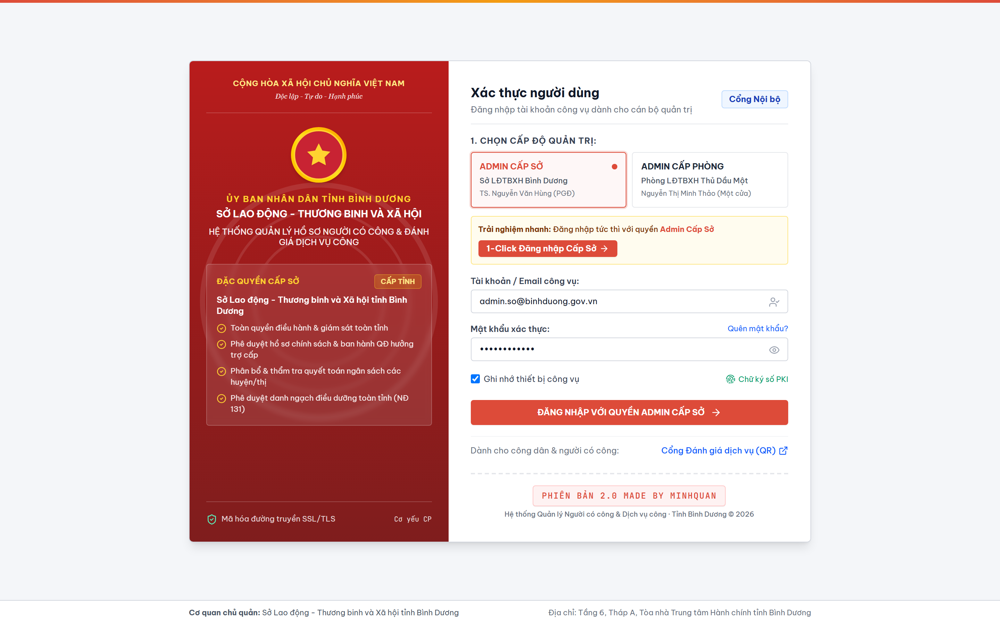
  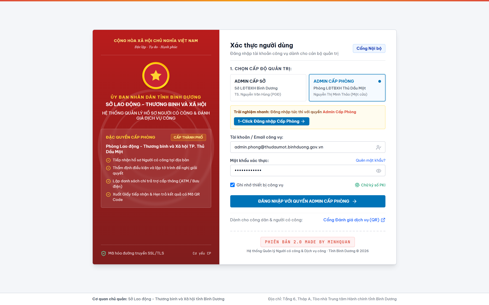
</p>

* Dưới cùng của Cổng đăng nhập ghi nhận dấu ấn phiên bản: **`PHIÊN BẢN 2.0 MADE BY MINHQUAN`**.

---

### 2. Bảng Điều Khiển Trung Tâm & Phân Tầng Màu Sắc Trực Quan (`/`)
Trang chủ điều hành cung cấp các thẻ KPI quan trọng: Tổng số đối tượng, Kinh phí chi trả hàng tháng, Tỷ lệ hồ sơ đúng hạn, Điểm hài lòng CSAT và Cảnh báo hồ sơ quá hạn xử lý.

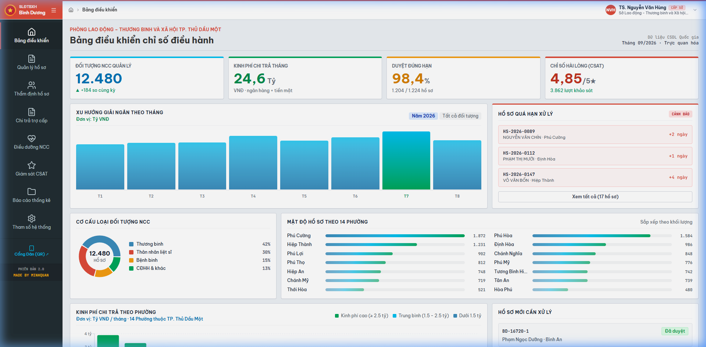

Biểu đồ cột **"Kinh phí chi trả theo phường"** được phối màu phân tầng trực quan theo 3 cấp độ ngân sách, xóa bỏ hoàn toàn tình trạng màu đen đơn điệu:
- 🟢 **Xanh Lá Emerald (`#00a65a`)**: Kinh phí cao ($\ge 2.5$ tỷ VNĐ/tháng) như Phú Cường, Phú Hòa, Hiệp Thành.
- 🩵 **Xanh Ngọc Cyan (`#00c0ef`)**: Kinh phí trung bình ($1.5 - 2.5$ tỷ VNĐ/tháng).
- 🔵 **Xanh Lam Royal Blue (`#3c8dbc`)**: Kinh phí dưới $1.5$ tỷ VNĐ/tháng.
- Tooltip thẻ trắng đổ bóng nổi, tiêu đề đỏ đậm hiển thị rõ nét từng phường khi rê chuột.

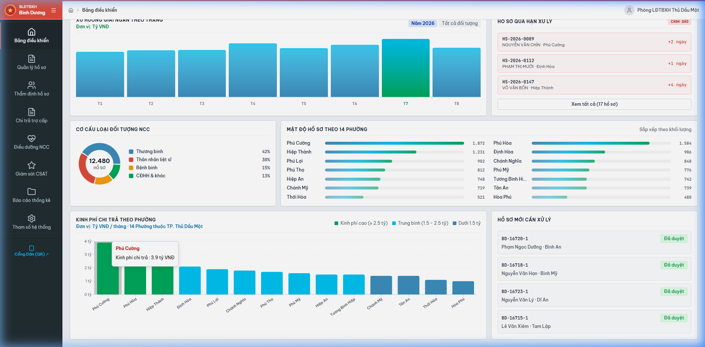

---

### 3. Menu Tài Khoản & Chuyển Đổi Nhanh Giữa Cấp Sở và Cấp Phòng
Cán bộ có thể xem thông tin cá nhân, chức vụ, phạm vi thẩm quyền và chuyển đổi qua lại linh hoạt giữa **Admin Cấp Sở** và **Admin Cấp Phòng** chỉ với 1 cú click ngay trên thanh Header.

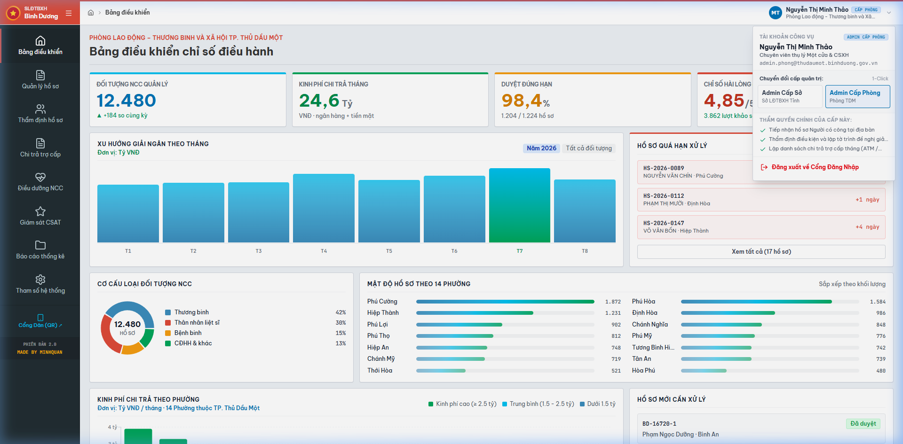

---

### 4. Xuất Giấy Hẹn Một Cửa Tích Hợp Mã QR Đánh Giá (`/ho-so`)
Khi tiếp nhận hồ sơ tại Bộ phận Một cửa, cán bộ nhấn in để xuất **Giấy tiếp nhận hồ sơ và Hẹn trả kết quả** chuẩn Mẫu số 01 (Nghị định 61/2018/NĐ-CP).

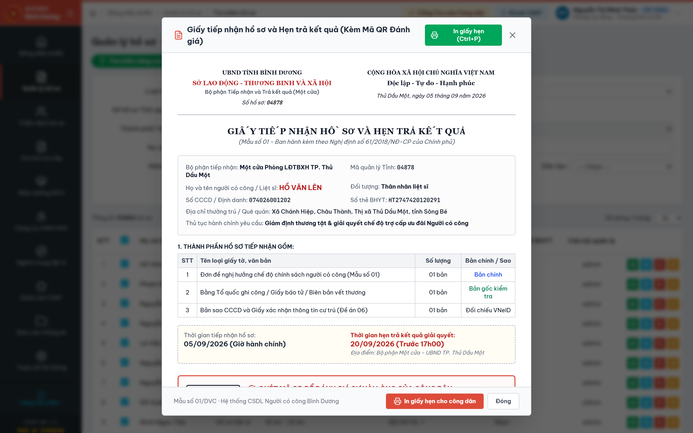

* Khối **Mã QR Code lớn** in ngay trên giấy hẹn: Công dân chỉ cần mở camera điện thoại hoặc Zalo quét mã là chuyển ngay đến Cổng đánh giá với mã hồ sơ được điền sẵn.

---

### 5. Phân Hệ Đánh Giá CSAT Dành Riêng Cho Người Dân (`/khao-sat`)
Giao diện hoàn toàn tách biệt với hệ thống cán bộ: không có thanh menu quản lý, tối ưu hoàn hảo cho màn hình di động và Kiosk cảm ứng. Chữ to, nút bấm lớn, hình mặt cười 1-5 sao và các thẻ góp ý nhanh giúp người cao tuổi và thân nhân liệt sĩ thao tác dễ dàng.

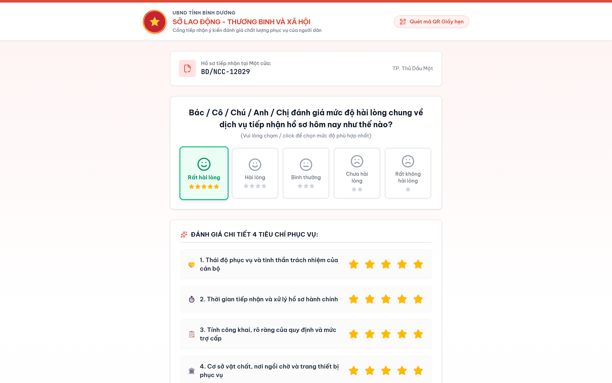

---

### 6. Trung Tâm Giám Sát CSAT & SIPAS Của Cán Bộ (`/danh-gia`)
Dữ liệu đánh giá của người dân sau khi gửi sẽ lập tức đồng bộ về màn hình giám sát của cán bộ:
- Theo dõi 4 chỉ số KPI: Tỷ lệ CSAT, Tổng lượt đánh giá, Ý kiến chưa hài lòng ($\le 2$ sao) cần giải trình.
- Biểu đồ **Radar 4 tiêu chí cốt lõi (Chuẩn SIPAS)**: Thái độ phục vụ, Thời gian xử lý, Tính công khai minh bạch, Cơ sở vật chất.
- Bảng xếp hạng CSAT 14 phường/xã và nhật ký phản hồi công dân thời gian thực.

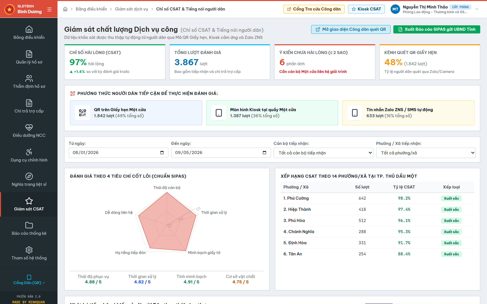

---

### 7. Quản Lý Chi Trả Trợ Cấp & Xuất Phiếu Chi Mẫu C70a-HD (`/chi-tra`)
Quản lý danh sách chi trả trợ cấp hàng tháng qua Tài khoản Ngân hàng (ATM) và Bưu điện văn hóa xã. Hỗ trợ xuất Phiếu chi chuẩn Mẫu C70a-HD có mã vạch xác thực.

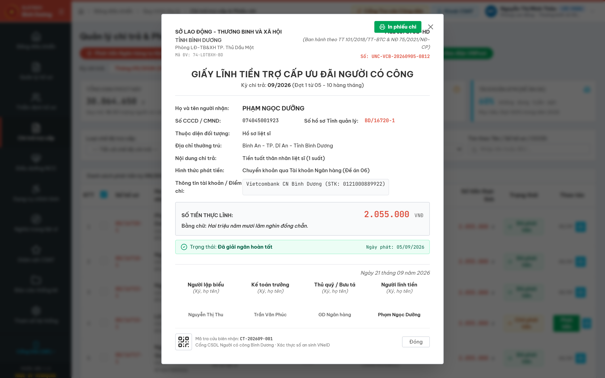

---

### 8. Tra Cứu & Xem Chi Tiết Hồ Sơ Liệt Sĩ (`/ho-so/$id`)
Xem đầy đủ thông tin trích lục liệt sĩ, nguyên quán, nơi hy sinh, nghĩa trang an táng, danh sách thân nhân thờ cúng và các quyết định hưởng tiền tuất hàng tháng.

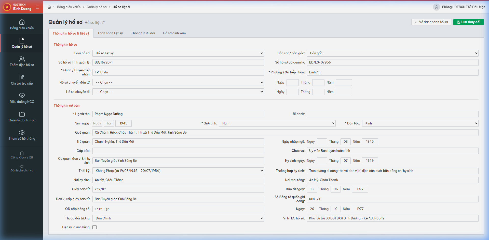

---

### 9. Quản Lý Chế Độ Điều Dưỡng Người Có Công (`/dieu-duong`)
Thực hiện nghiêm túc quy định tại **Nghị định 131/2021/NĐ-CP**:
- Phân loại điều dưỡng: Hàng năm (thương binh nặng $>81\%$, Mẹ VNAH) và 2 năm một lần.
- Quản lý 2 hình thức: **Điều dưỡng tập trung** (kinh phí 4.869.000 đ/người) và **Điều dưỡng tại nhà** (kinh phí 2.434.500 đ/người).
- Theo dõi chỉ tiêu phân bổ và danh sách đoàn đi điều dưỡng tại Vũng Tàu, Đà Lạt, Nha Trang.

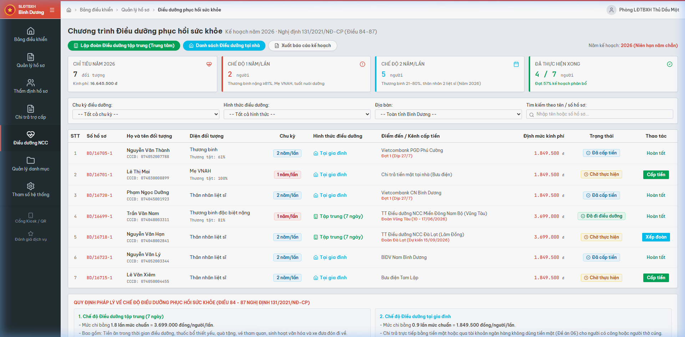

---

### 10. Bản Đồ Nhiệt & Báo Cáo Thống Kê Phân Tích (`/phan-tich`)
Bản đồ nhiệt mật độ đối tượng trên 14 phường/xã TP. Thủ Dầu Một chuyển màu trực quan từ xanh lá sang xanh lam, kết hợp biểu đồ dự báo ngân sách và cơ cấu chính sách.

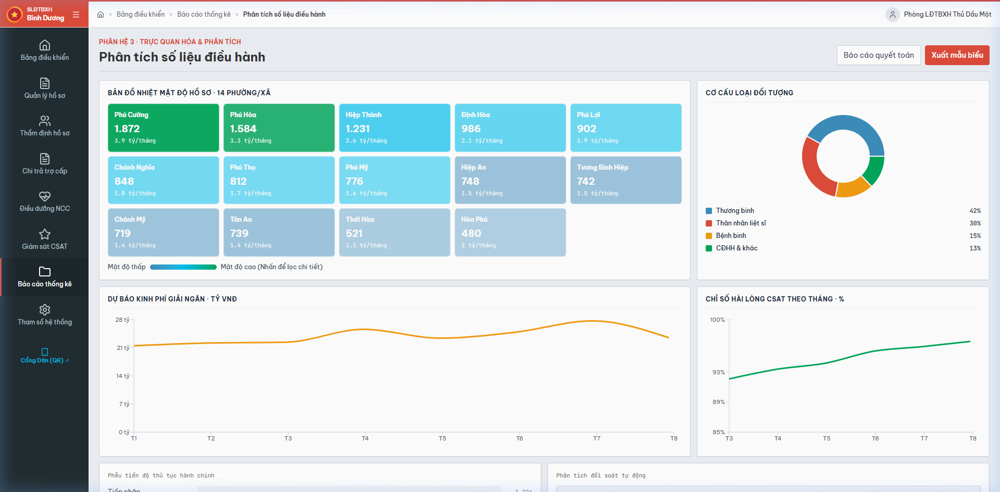

---

### 11. Quản Lý Phương Tiện Trợ Giúp & Dụng Cụ Chỉnh Hình (`/dung-cu-chinh-hinh`)
Theo dõi xe lăn, chân tay giả, máy trợ thính theo niên hạn 3 - 5 năm (Nghị định 131/2021/NĐ-CP) và xuất phiếu cấp.

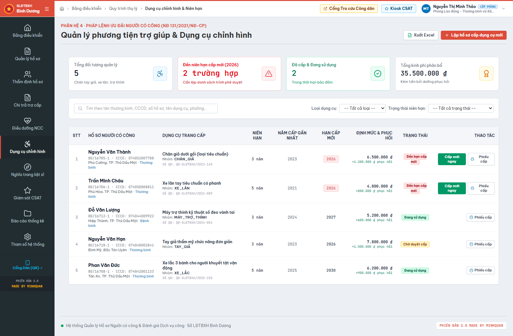

---

### 12. Bản Đồ Số Nghĩa Trang Liệt Sĩ GIS & Dâng Hương Online (`/nghia-trang`)
Bản đồ số tương tác 4 phân khu A, B, C, D, định vị chính xác vị trí ngôi mộ liệt sĩ và thực hiện nghi thức thắp nén hương / dâng hoa tri ân trực tuyến.

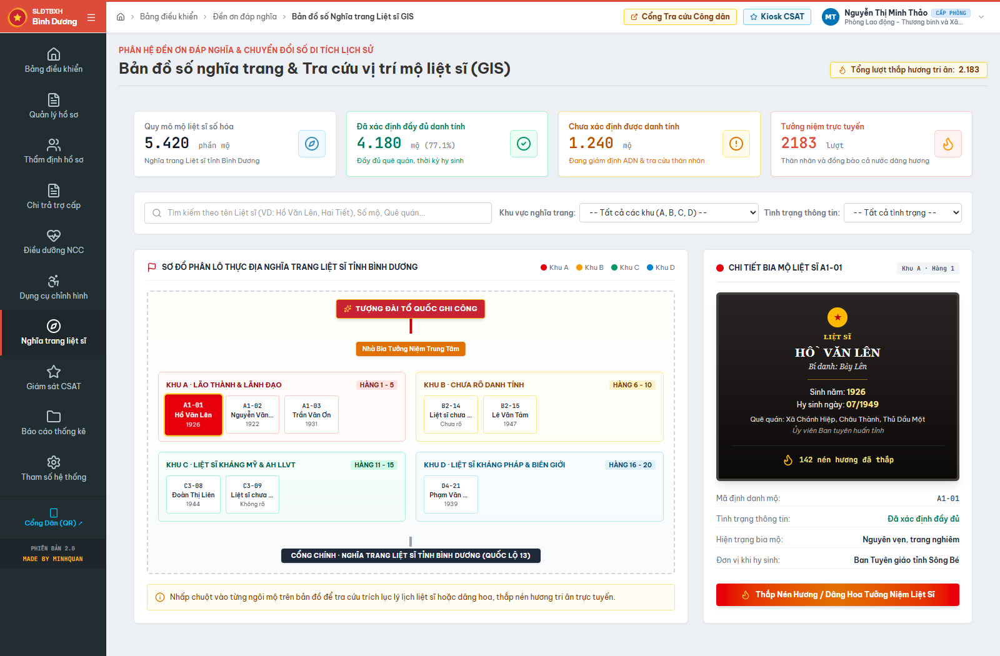

---

### 13. Cổng Dịch Vụ Tra Cứu Trực Tuyến Công Dân (`/tra-cuu`)
Tra cứu tiến độ giải quyết hồ sơ theo số CCCD (ẩn 3 số cuối bảo mật), xem timeline quy trình 5 bước và lịch phát tiền tại nhà / ATM.

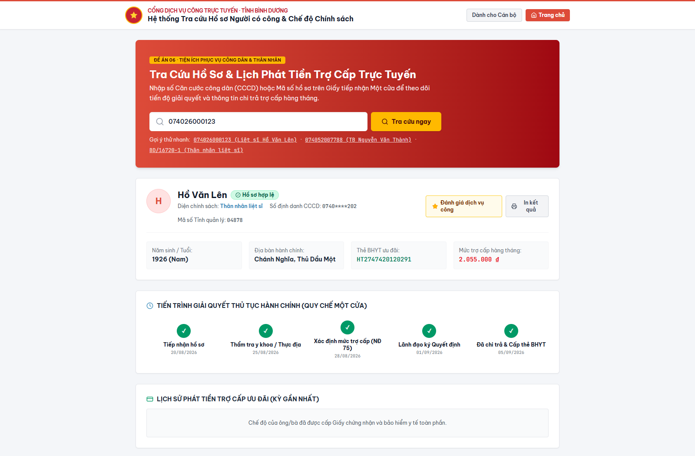

---

### 14. Quy Trình Báo Giảm Từ Trần & Quyết Định Mai Táng Phí (Mẫu 02 - NĐ 131)
Ngăn ngừa thất thoát ngân sách khi người hưởng qua đời, tự động dừng chi trả hàng tháng tức thời và xuất Quyết định Mai táng phí định mức 10 lần mức chuẩn ($20.550.000$đ).

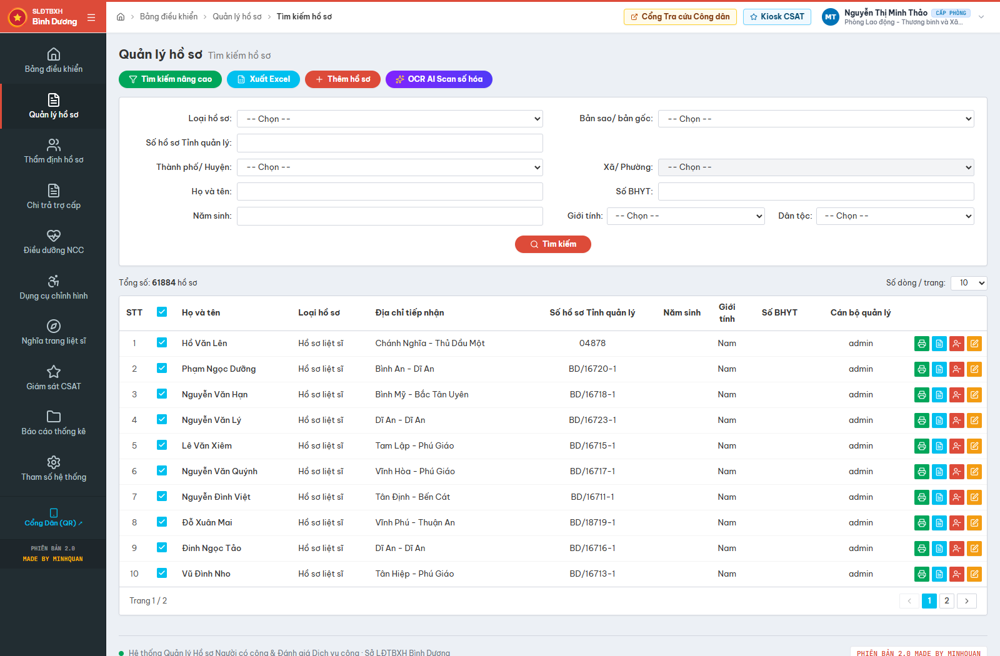

---

### 15. Module Đối Soát Tự Động Ngân Hàng (Bank Reconciliation)
Nạp tệp sao kê ngân hàng (Vietcombank, Agribank, BIDV, VNPost), tự động khớp lệnh thanh toán trợ cấp và phát hiện các giao dịch lỗi tài khoản.

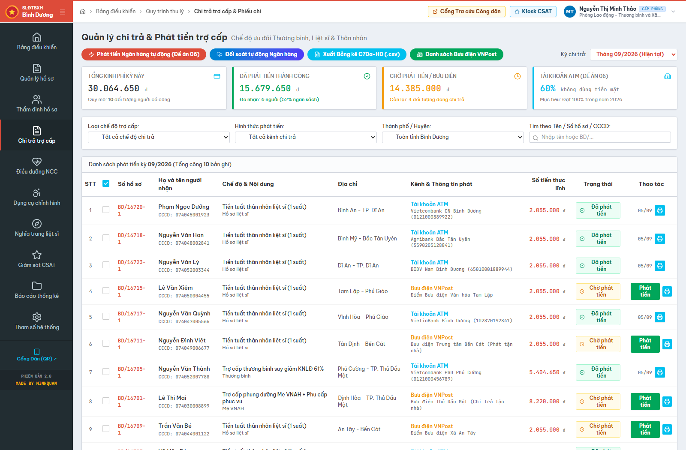

---

### 16. Quy Trình Thẩm Định 5 Bước Một Cửa & Ký Số SmartCA (`/tham-dinh`)
Chu trình thẩm định hồ sơ điện tử liên thông khép kín, phân bổ thẩm quyền chuyên viên và ký số công vụ của Lãnh đạo Sở.

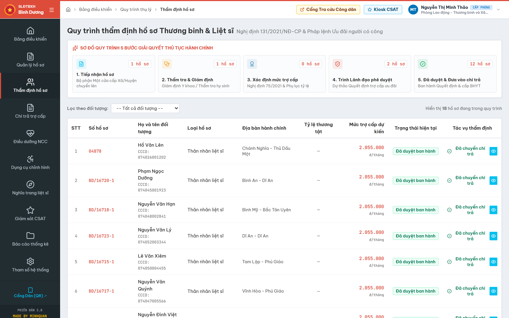

---

### 17. Cấu Hình Tham Số Hệ Thống & Mức Chuẩn Trợ Cấp (`/he-thong`)
Quản lý tham số định mức trợ cấp chuẩn ($2.055.000$ VNĐ) và danh mục loại chính sách ưu đãi người có công.

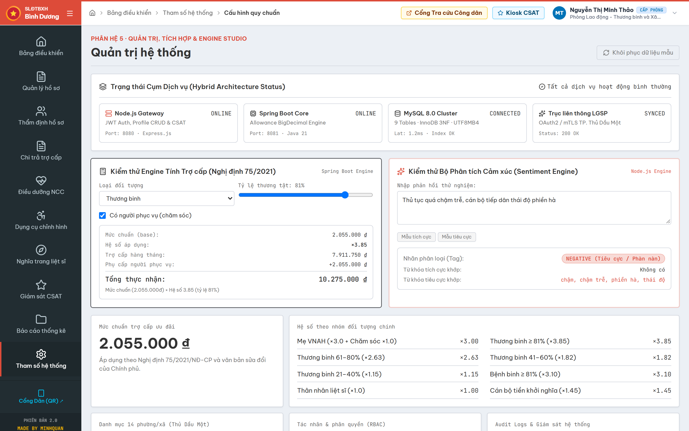

---

### 18. Tiếp Nhận Hồ Sơ Mới (Zod Validation & Chống Trùng CCCD)
Biểu mẫu tiếp nhận Một cửa kiểm tra định dạng CCCD 12 số, ngày sinh, tính hợp lệ và tự động tính toán sơ bộ mức trợ cấp.

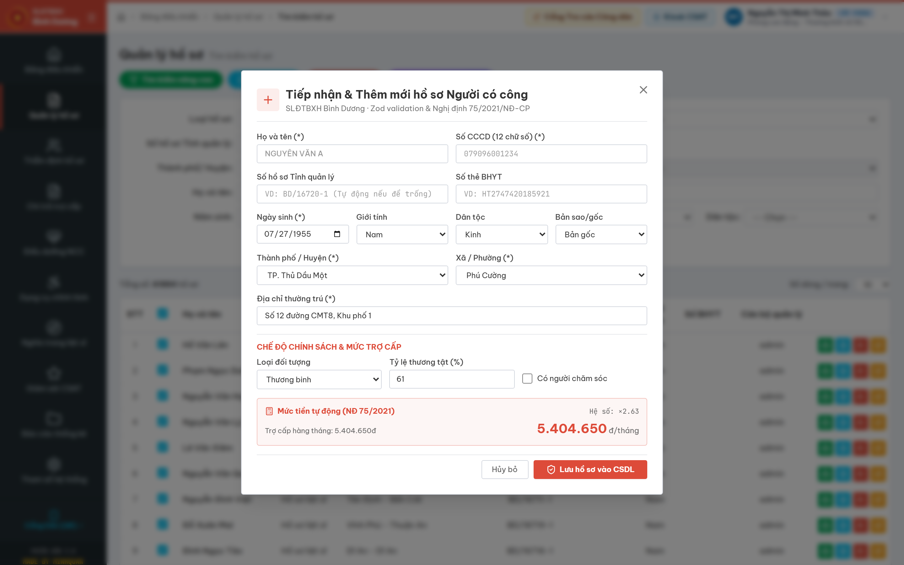

---

### 19. Số Hóa AI OCR Bằng Tổ Quốc Ghi Công & Giấy Báo Tử Cũ
Mô phỏng trí tuệ nhân tạo OCR nhận dạng văn bản cũ thời kỳ kháng chiến, bóc tách chính xác thông tin liệt sĩ để nhập liệu tự động.


---

## 🏛️ PHẦN I: ĐẶC TẢ USE CASE SIÊU CHI TIẾT (USE CASE SPECIFICATIONS)

### 1.1. Danh Sách Tác Nhân Hệ Thống (Actors)

| Tác Nhân (Actor) | Phân Loại | Vai Trò & Thẩm Quyền Trong Hệ Thống |
| :--- | :--- | :--- |
| **Admin Cấp Sở** (`ADMIN_SO`) | Cán bộ lãnh đạo | Ban Giám đốc Sở LĐTBXH tỉnh Bình Dương. Toàn quyền điều hành & giám sát toàn tỉnh, phê duyệt hồ sơ chính sách, ban hành Quyết định trợ cấp, phân bổ & thẩm tra quyết toán ngân sách, phê duyệt kế hoạch điều dưỡng, ký số điện tử SmartCA. |
| **Admin Cấp Phòng** (`ADMIN_PHONG`) | Cán bộ Một cửa | Chuyên viên thụ lý Một cửa & CSXH Phòng LĐTBXH TP. Thủ Dầu Một. Tiếp nhận hồ sơ mới, kiểm tra tính hợp lệ qua CCCD/LGSP, xuất Giấy hẹn Một cửa có mã QR, lập danh sách chi trả trợ cấp, thực hiện báo giảm từ trần, cấp dụng cụ chỉnh hình. |
| **Chuyên Viên Thẩm Định** | Cán bộ chuyên môn | Thẩm tra pháp lý hồ sơ, biên bản giám định y khoa thương tật, tính toán định mức trợ cấp, lập tờ trình chuyển lãnh đạo phê duyệt. |
| **Công Dân / Thân Nhân NCC** (`CITIZEN`) | Người dùng công cộng | Người có công, thân nhân liệt sĩ hoặc người thờ cúng. Tra cứu tiến độ giải quyết hồ sơ qua số CCCD, quét mã QR trên Giấy hẹn hoặc dùng Kiosk để đánh giá sự hài lòng (CSAT/SIPAS), tra cứu vị trí mộ liệt sĩ và dâng hương online. |
| **Hệ Thống Ngân Hàng / Bưu Điện** (`EXTERNAL_BANK`) | Hệ thống đối tác | Ngân hàng TMCP (Vietcombank, Agribank, BIDV) và Bưu điện văn hóa xã (VNPost). Tiếp nhận file ủy nhiệm chi (UNC) / chi trả, phản hồi tệp sao kê giao dịch để hệ thống đối soát tự động. |
| **Trục Liên Thông Dữ Liệu LGSP** (`LGSP_SYSTEM`) | Hệ thống nền tảng | Trục kết nối liên thông dữ liệu quốc gia / CSDL Dân cư Quốc gia (Đề án 06). Xác thực thông tin CCCD gắn chip và tình trạng cư trú của công dân. |

---

### 1.2. Sơ Đồ Tổng Quan Use Case (Mermaid Use Case Diagram)


```mermaid
flowchart TB
    subgraph ACTORS["TÁC NHÂN HỆ THỐNG"]
        direction TB
        AS["🏛️ Admin Cấp Sở"]
        AP["🏢 Admin Cấp Phòng / Một Cửa"]
        CZ["👤 Công Dân / Thân Nhân NCC"]
        BK["🏦 Ngân Hàng / Bưu Điện"]
    end

    subgraph SYSTEM["🏛️ HỆ THỐNG QUẢN LÝ HỒ SƠ NGƯỜI CÓ CÔNG (V2.0)"]
        direction TB
        
        subgraph MOD_HOSO["Phân Hệ Hồ Sơ & Một Cửa"]
            UC01(["UC-01: Tiếp nhận & Khởi tạo hồ sơ NCC"])
            UC02(["UC-02: Thẩm định & Tự động tính trợ cấp"])
            UC03(["UC-03: Lãnh đạo duyệt & Ký số SmartCA"])
            UC04(["UC-04: Xuất Giấy hẹn Một cửa có Mã QR"])
        end

        subgraph MOD_TAICHINH["Phân Hệ Chi Trả & Ngân Sách"]
            UC05(["UC-05: Lập danh sách & Phát tiền ATM/Bưu điện"])
            UC06(["UC-06: Đối soát tự động ngân hàng"])
            UC07(["UC-07: Báo giảm từ trần & QĐ Mai táng phí"])
            UC08(["UC-08: Quản lý cấp Dụng cụ chỉnh hình"])
            UC09(["UC-09: Quản lý chế độ Điều dưỡng NCC"])
        end

        subgraph MOD_GIS["Phân Hệ Nghĩa Trang Liệt Sĩ & Công Dân"]
            UC10(["UC-10: Bản đồ số Nghĩa trang GIS & Thắp hương"])
            UC11(["UC-11: Cổng tra cứu tiến độ hồ sơ qua CCCD"])
            UC12(["UC-12: Đánh giá CSAT qua QR Code / Kiosk"])
        end

        subgraph MOD_ADMIN["Phân Hệ Giám Sát & An Toàn Dữ Liệu"]
            UC13(["UC-13: Giám sát CSAT & Radar SIPAS"])
            UC14(["UC-14: Trung tâm cảnh báo sớm rủi ro"])
            UC15(["UC-15: Số hóa AI OCR tài liệu cũ"])
            UC16(["UC-16: Phân tích BI & Bản đồ nhiệt 14 phường"])
        end
    end

    %% Liên kết Cấp Phòng
    AP --> UC01
    AP --> UC02
    AP --> UC04
    AP --> UC05
    AP --> UC07
    AP --> UC08
    AP --> UC09

    %% Liên kết Cấp Sở
    AS --> UC03
    AS --> UC06
    AS --> UC13
    AS --> UC14
    AS --> UC15
    AS --> UC16
    AS --> UC09

    %% Liên kết Công Dân
    CZ --> UC10
    CZ --> UC11
    CZ --> UC12

    %% Liên kết Ngân Hàng
    BK --> UC06
    BK -.-> UC05
```

---

### 1.3. Ma Trận Use Case Toàn Hệ Thống (Use Case Matrix)

| Mã UC | Tên Use Case | Tác Nhân Chính | Tác Nhân Phụ | Mức Độ | Mô Tả Tóm Tắt |
| :--- | :--- | :--- | :--- | :---: | :--- |
| **UC-01** | Tiếp nhận & Tạo mới hồ sơ NCC | Admin Cấp Phòng | LGSP | Critical | Kiểm tra validation Zod, chống trùng CCCD, sinh mã quản lý và tính trợ cấp sơ bộ. |
| **UC-02** | Thẩm định & Tự động tính trợ cấp | Chuyên viên Thẩm định | - | High | Tính toán theo tỷ lệ thương tật, kiểm tra điều kiện hưởng người phục vụ. |
| **UC-03** | Phê duyệt hồ sơ & Ký số SmartCA | Admin Cấp Sở | - | Critical | Ban hành Quyết định hưởng trợ cấp có mã băm SHA-256 xác thực lãnh đạo. |
| **UC-04** | Xuất Giấy hẹn Một cửa mã QR | Admin Cấp Phòng | Công dân | High | In Giấy tiếp nhận Mẫu số 01 (NĐ 61/2018) có mã QR trỏ thẳng đến Cổng đánh giá. |
| **UC-05** | Chi trả trợ cấp & In Phiếu C70a-HD | Admin Cấp Phòng | Ngân hàng, Bưu điện | Critical | Giải ngân đơn lẻ hoặc Batch Payout, xuất phiếu chi có mã vạch xác thực. |
| **UC-06** | Đối soát tự động ngân hàng | Admin Cấp Sở / Kế toán | Ngân hàng | High | Nạp tệp sao kê ngân hàng, tự động đối khớp mã giao dịch/CCCD, phát hiện sai sót. |
| **UC-07** | Báo giảm từ trần & Mai táng phí | Admin Cấp Phòng | Admin Cấp Sở | Critical | Tạm ngừng chi trả hàng tháng tức thì, lập Quyết định Mai táng phí Mẫu 02 (NĐ 131). |
| **UC-08** | Cấp phát Dụng cụ chỉnh hình | Admin Cấp Phòng | - | High | Theo dõi niên hạn 3 - 5 năm, cảnh báo đến hạn cấp mới, xuất phiếu cấp. |
| **UC-09** | Quản lý chế độ Điều dưỡng NCC | Admin Cấp Sở | Admin Cấp Phòng | High | Phân bổ chỉ tiêu điều dưỡng tập trung (1.8x) và tại nhà (0.9x), chu kỳ 1 năm / 2 năm. |
| **UC-10** | Bản đồ số Nghĩa trang GIS & Dâng hương | Công dân | Admin Cấp Sở | Medium | Tương tác tọa độ khu A, B, C, D; dâng hoa, thắp hương và tra cứu thông tin liệt sĩ. |
| **UC-11** | Cổng tra cứu tiến độ qua CCCD | Công dân | - | High | Tra cứu theo số CCCD (bảo mật ẩn 3 số đuôi), xem timeline 5 bước Một cửa. |
| **UC-12** | Khảo sát sự hài lòng CSAT/SIPAS | Công dân | - | High | Đánh giá 1-5 sao, chấm 4 tiêu chí SIPAS, tự động phân tích cảm xúc sentiment. |
| **UC-13** | Giám sát CSAT & Báo cáo SIPAS | Admin Cấp Sở / Cấp Phòng | - | High | Xem biểu đồ Radar 4 tiêu chí, bảng xếp hạng 14 phường, cảnh báo ý kiến tiêu cực. |
| **UC-14** | Trung tâm Cảnh báo sớm Rủi ro | Admin Cấp Sở | - | Critical | Cảnh báo con liệt sĩ đủ 18 tuổi, hồ sơ sắp trễ hạn, đối tượng mất chưa báo giảm. |
| **UC-15** | Số hóa AI OCR tài liệu cũ | Admin Cấp Phòng | - | Medium | Nhận dạng văn bản Bằng Tổ quốc ghi công / Giấy báo tử cũ bóc tách trường dữ liệu. |
| **UC-16** | Phân tích BI & Heatmap 14 phường | Admin Cấp Sở | - | High | Bản đồ nhiệt phân bổ đối tượng, cơ cấu ngân sách và dự báo biến động tài chính. |

---

### 1.4. Đặc Tả Chi Tiết Từng Use Case Trọng Yếu

#### 📌 UC-01: Tiếp Nhận & Khởi Tạo Hồ Sơ Người Có Công
* **Mã Use Case:** `UC-01`
* **Tác nhân:** Admin Cấp Phòng (Chuyên viên tiếp nhận Một cửa).
* **Mục tiêu:** Tạo mới hồ sơ người có công vào hệ thống, đảm bảo dữ liệu hợp lệ và chống trùng lặp định danh.
* **Tiền điều kiện:** Cán bộ đã đăng nhập tài khoản Cấp Phòng (`admin.phong`).
* **Kích hoạt (Trigger):** Cán bộ bấm nút **"+ Tiếp nhận hồ sơ mới"** tại màn hình `/ho-so`.
* **Luồng sự kiện chính (Happy Path):**
  1. Hệ thống hiển thị modal **"Tiếp nhận hồ sơ Người có công mới"**.
  2. Cán bộ nhập các trường thông tin: Số CCCD (12 số), Họ và tên, Ngày sinh, Giới tính, Dân tộc, Số BHYT, Địa chỉ thường trú, Phường/Xã (chọn trong 14 phường TP. Thủ Dầu Một), Loại đối tượng, Tỷ lệ thương tật (21% - 100%), Trạng thái người phục vụ.
  3. Cán bộ bấm **"Lưu hồ sơ"**.
  4. Hệ thống kiểm tra hợp lệ dữ liệu bằng thư viện Zod (`createProfileSchema`).
  5. Hệ thống quét toàn bộ CSDL kiểm tra số CCCD đã tồn tại hay chưa.
  6. Hệ thống tự động sinh mã quản lý `HS-YYYY-XXXXXX` và mã số tỉnh `BD/XXXXX-1`.
  7. Hệ thống gọi Calculation Engine để tính sơ bộ mức trợ cấp tháng, phụ cấp phục vụ và trợ cấp điều dưỡng.
  8. Hệ thống lưu hồ sơ mới với trạng thái `MỚI_TIẾP_NHẬN`, ghi nhật ký Audit Log.
  9. Hệ thống đóng modal, thông báo thành công và tự động cập nhật danh sách hồ sơ.
* **Các luồng ngoại lệ & rẽ nhánh:**
  - *Ngoại lệ 1 (CCCD sai định dạng):* Nếu CCCD không đủ 12 chữ số hoặc chứa chữ cái ➔ Hệ thống chặn gửi, hiển thị thông báo lỗi đỏ ngay dưới ô nhập liệu.
  - *Ngoại lệ 2 (Trùng số CCCD):* Nếu CCCD đã tồn tại trong CSDL ➔ Hệ thống rollback, hiển thị thông báo cảnh báo: *"Số CCCD [X] đã tồn tại trong hồ sơ [Mã HS] ([Họ tên])!"*.
* **Hậu điều kiện:** Hồ sơ mới được ghi nhận vào hệ thống với trạng thái `MỚI_TIẾP_NHẬN`, hiển thị trên danh sách chờ thẩm định.

---

#### 📌 UC-02: Thẩm Định Hồ Sơ & Ban Hành Quyết Định Hưởng (Giao Dịch ACID)
* **Mã Use Case:** `UC-02`
* **Tác nhân:** Admin Cấp Sở (`TS. Nguyễn Văn Hùng`) / Chuyên viên Thẩm định.
* **Mục tiêu:** Kiểm tra điều kiện pháp lý, tự động tính định mức trợ cấp chính xác theo Nghị định và ban hành Quyết định hưởng trợ cấp.
* **Tiền điều kiện:** Hồ sơ đang ở trạng thái `MỚI_TIẾP_NHẬN` hoặc `ĐANG_THẨM_ĐỊNH`.
* **Luồng sự kiện chính:**
  1. Cán bộ vào chi tiết hồ sơ hoặc màn hình `/tham-dinh`, chọn hồ sơ cần duyệt.
  2. Kiểm tra biên bản giám định y khoa thương tật, giấy tờ xác nhận người có công.
  3. Bấm **"Phê duyệt & Ban hành QĐ"**.
  4. Hệ thống bắt đầu giao dịch ACID (Database Transaction):
     - Bước 4.1: Gọi `calculateAllowance` với công thức:
       $$\text{Trợ cấp tháng} = \text{Mức chuẩn } (2.055.000) \times \text{Hệ số thương tật}$$
       $$\text{Phụ cấp phục vụ} = \text{Mức chuẩn } \times 1.0 \quad (\text{nếu tỷ lệ } \ge 81\% \text{ và có người chăm sóc})$$
     - Bước 4.2: Tự động sinh số Quyết định `QĐ-UBND-YYYY/XXXX`.
     - Bước 4.3: Tạo bản ghi mới trong bảng `quyet_dinh_huong`.
     - Bước 4.4: Cập nhật trạng thái hồ sơ trong bảng `ho_so_ncc` thành `ĐÃ_DUYỆT`.
     - Bước 4.5: Ghi nhận Audit Log thành công.
  5. Hệ thống commit giao dịch và hiển thị thông báo phê duyệt thành công cùng số tiền thực nhận.
* **Luồng ngoại lệ (Rollback khi lỗi giao dịch):**
  - Nếu xảy ra lỗi ở bất kỳ bước nào (ví dụ không ghi được quyết định), hệ thống tự động Rollback toàn bộ, trạng thái hồ sơ giữ nguyên không bị đổi thành `ĐÃ_DUYỆT`.

---

#### 📌 UC-04: Xuất Giấy Hẹn Một Cửa Tích Hợp Mã QR Đánh Giá
* **Mã Use Case:** `UC-04`
* **Tác nhân:** Admin Cấp Phòng / Công dân.
* **Mục tiêu:** Cung cấp Giấy tiếp nhận hồ sơ & Hẹn trả kết quả theo chuẩn Mẫu số 01 (NĐ 61/2018/NĐ-CP), tích hợp mã QR Code để công dân quét đánh giá sự hài lòng.
* **Luồng sự kiện chính:**
  1. Tại danh sách hồ sơ, cán bộ nhấn nút biểu tượng **Mã QR / In giấy hẹn**.
  2. Modal Giấy hẹn mở ra với đầy đủ Quốc hiệu, Tiêu ngữ, tên cơ quan tiếp nhận (UBND TP. Thủ Dầu Một - Bộ phận Một cửa), thông tin người nộp, ngày hẹn trả kết quả.
  3. Hệ thống tự động tạo mã QR Code động chứa URL dẫn thẳng đến Cổng đánh giá:
     `https://qldm-sldtbxh.binhduong.gov.vn/khao-sat?hoSoId=[MÃ_HỒ_SƠ]`
  4. Cán bộ bấm **"In giấy tiếp nhận"** để in ra máy in nhiệt hoặc lưu PDF gửi người dân.
  5. Người dân dùng điện thoại thông minh quét mã QR trên giấy hẹn ➔ Trình duyệt tự mở trang đánh giá với mã hồ sơ đã được điền sẵn.

---

#### 📌 UC-05: Quản Lý Chi Trả Trợ Cấp & Xuất Phiếu Chi Mẫu C70a-HD
* **Mã Use Case:** `UC-05`
* **Tác nhân:** Admin Cấp Phòng / Kế toán tài chính.
* **Mục tiêu:** Thực hiện giải ngân trợ cấp tháng qua Ngân hàng (ATM) hoặc Bưu điện văn hóa xã, hỗ trợ thanh toán hàng loạt và in chứng từ kế toán.
* **Luồng sự kiện chính:**
  1. Cán bộ truy cập màn hình `/chi-tra`.
  2. Lọc danh sách theo Kỳ chi trả (VD: `09/2026`), Hình thức nhận (Ngân hàng / Bưu điện), Phường/Xã và Trạng thái (`CHỜ_CHI_TRẢ`).
  3. *Trường hợp 1 - Chi lẻ:* Cán bộ bấm **"Phát tiền"** tại dòng đối tượng ➔ Hệ thống sinh mã giao dịch `UNC-VCB-...`, cập nhật trạng thái `ĐÃ_CHI_TRẢ`, ghi ngày chi trả.
  4. *Trường hợp 2 - Chi hàng loạt (Batch Payout):* Cán bộ chọn nhiều dòng hoặc chọn tất cả ➔ Bấm **"Phát tiền hàng loạt"** ➔ Hệ thống cập nhật đồng loạt trạng thái và xuất thông báo số lượng bản ghi thành công.
  5. Cán bộ bấm **"In phiếu chi C70a-HD"** ➔ Hệ thống hiển thị mẫu Phiếu chi chuẩn Bộ Tài chính kèm mã vạch Barcode định danh phiếu để in lưu trữ.

---

#### 📌 UC-06: Báo Giảm Từ Trần & Quyết Định Mai Táng Phí (Mẫu 02 - NĐ 131)
* **Mã Use Case:** `UC-06`
* **Tác nhân:** Admin Cấp Phòng.
* **Mục tiêu:** Kịp thời ghi nhận thông tin đối tượng từ trần, tự động khóa chi trả hàng tháng để chống thất thoát ngân sách, ban hành Quyết định hỗ trợ Mai táng phí.
* **Quy tắc nghiệp vụ:**
  - Định mức Mai táng phí $= 10 \times \text{Mức chuẩn} = 10 \times 2.055.000 = 20.550.000 \text{ VNĐ}$.
  - Tự động chuyển các khoản chi trả tháng đang `CHỜ_CHI_TRẢ` của đối tượng sang trạng thái `TỒN_ĐỌNG (TẠM NGỪNG DO TỪ TRẦN)`.
* **Luồng sự kiện chính:**
  1. Cán bộ mở modal **"Báo giảm từ trần"** từ danh sách hồ sơ hoặc thanh tác vụ.
  2. Nhập thông tin: Ngày mất, Nơi mất, Số trích lục khai tử, Ngày cấp, Nơi cấp trích lục, Họ tên thân nhân khai báo, Số CCCD, SĐT người khai.
  3. Bấm **"Xác nhận Báo giảm & Ban hành QĐ"**.
  4. Hệ thống cập nhật cờ `isTuTran = true` trong hồ sơ, khóa chi trả trợ cấp hàng tháng.
  5. Hệ thống sinh số Quyết định Mai táng phí: `QĐ-UBND/YYYY-MTP-XXX` và ghi vào bảng báo giảm.
  6. Hệ thống xuất bản in Quyết định trợ cấp Mai táng phí chuẩn Mẫu số 02 (Nghị định 131/2021/NĐ-CP) có quốc huy và chữ ký số.

---

#### 📌 UC-07: Quản Lý Phương Tiện Trợ Giúp & Dụng Cụ Chỉnh Hình
* **Mã Use Case:** `UC-07`
* **Tác nhân:** Admin Cấp Phòng / Cấp Sở.
* **Mục tiêu:** Theo dõi và cấp mới các phương tiện trợ giúp (chân giả, tay giả, xe lăn, xe lắc, máy trợ thính...) theo niên hạn quy định tại Điều 90-93 Nghị định 131/2021/NĐ-CP.
* **Quy tắc niên hạn:**
  - Xe lăn, xe lắc: Niên hạn 05 năm / lần.
  - Chân giả, tay giả: Niên hạn 03 năm / lần.
  - Máy trợ thính: Niên hạn 03 năm / lần.
* **Luồng sự kiện chính:**
  1. Cán bộ truy cập màn hình `/dung-cu-chinh-hinh`.
  2. Hệ thống tự động so sánh năm hiện tại với năm cấp gần nhất:
     $$\text{Năm đến hạn} = \text{Năm cấp gần nhất} + \text{Niên hạn}$$
  3. Nếu $\text{Năm hiện tại} \ge \text{Năm đến hạn}$ ➔ Hiển thị nhãn cảnh báo đỏ **"ĐẾN HẠN CẤP MỚI"**.
  4. Cán bộ bấm **"Cấp mới / Gia hạn"**, chọn loại dụng cụ, định mức tiền và tiền bồi dưỡng phục hồi ➔ Hệ thống tạo Quyết định cấp và gia hạn niên hạn tiếp theo.

---

#### 📌 UC-08: Bản Đồ Số Nghĩa Trang Liệt Sĩ GIS & Tưởng Niệm Trực Tuyến
* **Mã Use Case:** `UC-08`
* **Tác nhân:** Công dân / Thân nhân Liệt sĩ.
* **Mục tiêu:** Tìm kiếm vị trí mộ liệt sĩ, xem thông tin trích lục và thực hiện nghi thức tâm linh dâng hoa, thắp nén hương tri ân qua không gian mạng.
* **Luồng sự kiện chính:**
  1. Người dùng truy cập màn hình `/nghia-trang`.
  2. Bản đồ số hiển thị tổng thể Nghĩa trang Liệt sĩ tỉnh Bình Dương chia thành 4 phân khu: Khu A (Cán bộ tiền khởi nghĩa), Khu B (Kháng chiến chống Pháp), Khu C (Kháng chiến chống Mỹ), Khu D (Chiến tranh bảo vệ Biên giới).
  3. Người dùng nhập tên liệt sĩ hoặc số mộ vào thanh tìm kiếm (VD: `Hồ Văn Lên` hoặc `A1-01`).
  4. Bản đồ tự động zoom và highlight ngôi mộ tương ứng với màu sắc nổi bật.
  5. Người dùng click vào ngôi mộ để xem: Họ tên, Năm sinh, Quê quán, Đơn vị, Ngày hy sinh, Tình trạng bia mộ.
  6. Người dùng nhấn nút **"Thắp nén hương tri ân"** hoặc **"Dâng lẵng hoa tươi"**:
     - Hiệu ứng khói hương nghi ngút và cánh hoa rơi trang trọng hiển thị trên màn hình.
     - Bộ đếm `luotThapHuong` của ngôi mộ tự động tăng thêm 1 và đồng bộ dữ liệu.

---

#### 📌 UC-09: Đối Soát Tự Động Giao Dịch Chi Trả Ngân Hàng (Reconciliation)
* **Mã Use Case:** `UC-09`
* **Tác nhân:** Kế toán tài chính / Admin Cấp Sở.
* **Mục tiêu:** Tự động đối chiếu danh sách chi trả của cơ quan với file kết quả chuyển khoản từ Ngân hàng (VCB, Agribank, BIDV) hoặc Bưu điện VNPost.
* **Luồng sự kiện chính:**
  1. Cán bộ truy cập màn hình `/chi-tra`, bấm **"Đối soát sao kê ngân hàng"**.
  2. Chọn mẫu ngân hàng đối soát (Vietcombank, Agribank, BIDV, Bưu điện).
  3. Nạp tệp sao kê điện tử (CSV / Excel).
  4. Hệ thống chạy thuật toán đối soát tự động:
     - So khớp trường `soHoSoTinh`, `cccd` hoặc `maGiaoDich`.
     - Nếu khớp và trạng thái là `THÀNH_CÔNG` ➔ Đánh dấu `ĐÃ_CHI_TRẢ`, ghi nhận ngày giờ chuyển tiền.
     - Nếu không khớp hoặc ngân hàng báo lỗi (tài khoản đóng, sai tên) ➔ Đánh dấu `TỒN_ĐỌNG`, lưu rõ nguyên nhân lỗi (VD: *"Lỗi số tài khoản thụ hưởng"*).
  5. Hệ thống tổng hợp báo cáo đối soát: Tổng số tiền khớp, số tiền lỗi, tỷ lệ giải ngân thành công và xuất biên bản đối soát tài chính.

---

#### 📌 UC-12: Khảo Sát Sự Hài Lòng CSAT & Phân Tích Cảm Xúc Sentiment
* **Mã Use Case:** `UC-12`
* **Tác nhân:** Công dân / Người có công.
* **Mục tiêu:** Lắng nghe đánh giá khách quan của người dân sau khi làm thủ tục hành chính, tự động phát hiện phản hồi tiêu cực để chấn chỉnh kịp thời.
* **Luồng sự kiện chính:**
  1. Công dân quét mã QR trên Giấy hẹn hoặc thao tác trên Kiosk cảm ứng tại Bộ phận Một cửa (`/khao-sat`).
  2. Chọn mức độ hài lòng chung từ 1 đến 5 sao (Mặt cười trực quan).
  3. Đánh giá 4 tiêu chí cốt lõi (1 - 5 điểm): Thái độ cán bộ, Thời gian giải quyết, Tính minh bạch thủ tục, Cơ sở vật chất Một cửa.
  4. Nhập ý kiến đóng góp bằng lời hoặc chọn thẻ góp ý nhanh.
  5. Bấm **"Gửi đánh giá"**.
  6. Backend tiếp nhận, gọi `analyzeSentiment`:
     - Nếu ý kiến chứa từ tiêu cực (*chậm, lâu, hách dịch, phiền hà, khó chịu*) ➔ Gắn nhãn `NEGATIVE`.
     - Nếu chứa từ tích cực (*nhanh, nhiệt tình, chu đáo, tốt, hài lòng*) ➔ Gắn nhãn `POSITIVE`.
     - Còn lại gắn nhãn `NEUTRAL`.
  7. Hệ thống lưu vào bảng `khao_sat_danh_gia` và lập tức cập nhật lên Dashboard của Cán bộ lãnh đạo (`/danh-gia`). Nếu là `NEGATIVE`, hệ thống phát cảnh báo đỏ yêu cầu cán bộ phụ trách giải trình.
  8. Màn hình Kiosk hiển thị lời cảm ơn và tự động quay về trang chủ sau 5 giây.

---

## 🏗️ PHẦN II: SƠ ĐỒ LỚP (CLASS DIAGRAM) TOÀN DIỆN

### 2.1. Sơ Đồ Lớp Thực Thể CSDL & Domain Model (Database Entity Diagram)

Sơ đồ lớp chuẩn hóa 3NF thể hiện toàn bộ các thực thể dữ liệu, thuộc tính, khóa chính/khóa ngoại và mối quan hệ giữa các bảng:

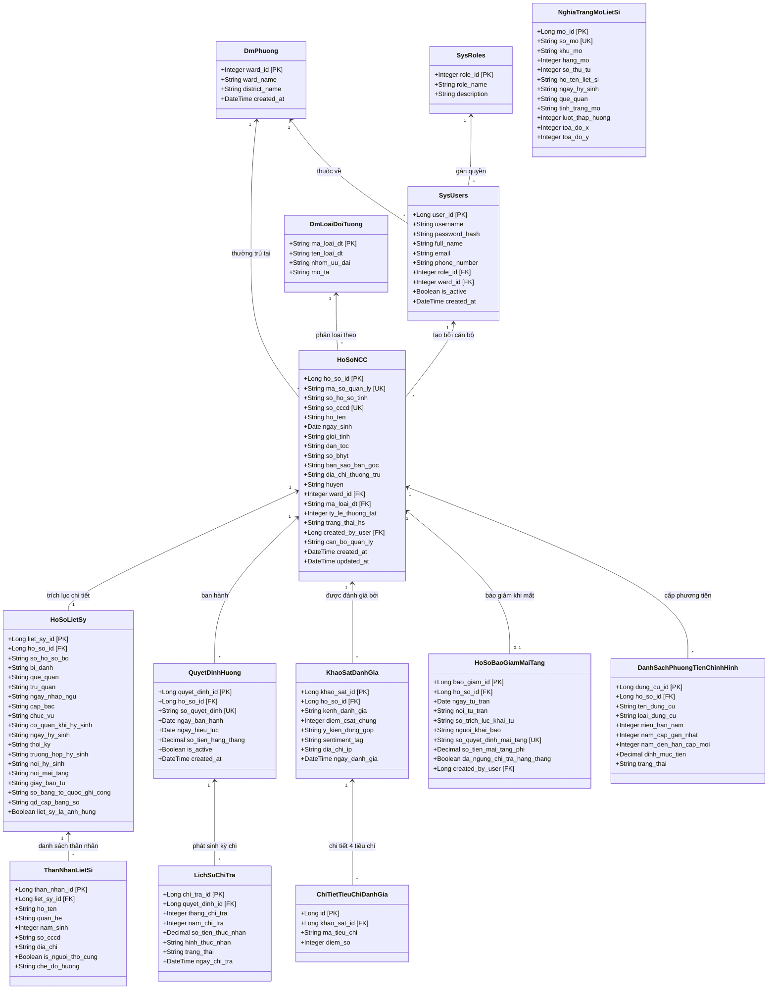
```mermaid
classDiagram
    direction TB

    class DmPhuong {
        +Integer ward_id [PK]
        +String ward_name
        +String district_name
        +DateTime created_at
    }

    class DmLoaiDoiTuong {
        +String ma_loai_dt [PK]
        +String ten_loai_dt
        +String nhom_uu_dai
        +String mo_ta
    }

    class SysRoles {
        +Integer role_id [PK]
        +String role_name
        +String description
    }

    class SysUsers {
        +Long user_id [PK]
        +String username
        +String password_hash
        +String full_name
        +String email
        +String phone_number
        +Integer role_id [FK]
        +Integer ward_id [FK]
        +Boolean is_active
        +DateTime created_at
    }

    class HoSoNCC {
        +Long ho_so_id [PK]
        +String ma_so_quan_ly [UK]
        +String so_ho_so_tinh
        +String so_cccd [UK]
        +String ho_ten
        +Date ngay_sinh
        +String gioi_tinh
        +String dan_toc
        +String so_bhyt
        +String ban_sao_ban_goc
        +String dia_chi_thuong_tru
        +String huyen
        +Integer ward_id [FK]
        +String ma_loai_dt [FK]
        +Integer ty_le_thuong_tat
        +String trang_thai_hs
        +Long created_by_user [FK]
        +String can_bo_quan_ly
        +DateTime created_at
        +DateTime updated_at
    }

    class HoSoLietSy {
        +Long liet_sy_id [PK]
        +Long ho_so_id [FK]
        +String so_ho_so_bo
        +String bi_danh
        +String que_quan
        +String tru_quan
        +String ngay_nhap_ngu
        +String cap_bac
        +String chuc_vu
        +String co_quan_khi_hy_sinh
        +String ngay_hy_sinh
        +String thoi_ky
        +String truong_hop_hy_sinh
        +String noi_hy_sinh
        +String noi_mai_tang
        +String giay_bao_tu
        +String so_bang_to_quoc_ghi_cong
        +String qd_cap_bang_so
        +Boolean liet_sy_la_anh_hung
    }

    class ThanNhanLietSi {
        +Long than_nhan_id [PK]
        +Long liet_sy_id [FK]
        +String ho_ten
        +String quan_he
        +Integer nam_sinh
        +String so_cccd
        +String dia_chi
        +Boolean is_nguoi_tho_cung
        +String che_do_huong
    }

    class QuyetDinhHuong {
        +Long quyet_dinh_id [PK]
        +Long ho_so_id [FK]
        +String so_quyet_dinh [UK]
        +Date ngay_ban_hanh
        +Date ngay_hieu_luc
        +Decimal so_tien_hang_thang
        +Boolean is_active
        +DateTime created_at
    }

    class LichSuChiTra {
        +Long chi_tra_id [PK]
        +Long quyet_dinh_id [FK]
        +Integer thang_chi_tra
        +Integer nam_chi_tra
        +Decimal so_tien_thuc_nhan
        +String hinh_thuc_nhan
        +String trang_thai
        +DateTime ngay_chi_tra
    }

    class KhaoSatDanhGia {
        +Long khao_sat_id [PK]
        +Long ho_so_id [FK]
        +String kenh_danh_gia
        +Integer diem_csat_chung
        +String y_kien_dong_gop
        +String sentiment_tag
        +String dia_chi_ip
        +DateTime ngay_danh_gia
    }

    class ChiTietTieuChiDanhGia {
        +Long id [PK]
        +Long khao_sat_id [FK]
        +String ma_tieu_chi
        +Integer diem_so
    }

    class HoSoBaoGiamMaiTang {
        +Long bao_giam_id [PK]
        +Long ho_so_id [FK]
        +Date ngay_tu_tran
        +String noi_tu_tran
        +String so_trich_luc_khai_tu
        +String nguoi_khai_bao
        +String so_quyet_dinh_mai_tang [UK]
        +Decimal so_tien_mai_tang_phi
        +Boolean da_ngung_chi_tra_hang_thang
        +Long created_by_user [FK]
    }

    class DanhSachPhuongTienChinhHinh {
        +Long dung_cu_id [PK]
        +Long ho_so_id [FK]
        +String ten_dung_cu
        +String loai_dung_cu
        +Integer nien_han_nam
        +Integer nam_cap_gan_nhat
        +Integer nam_den_han_cap_moi
        +Decimal dinh_muc_tien
        +String trang_thai
    }

    class NghiaTrangMoLietSi {
        +Long mo_id [PK]
        +String so_mo [UK]
        +String khu_mo
        +Integer hang_mo
        +Integer so_thu_tu
        +String ho_ten_liet_si
        +String ngay_hy_sinh
        +String que_quan
        +String tinh_trang_mo
        +Integer luot_thap_huong
        +Integer toa_do_x
        +Integer toa_do_y
    }

    %% Quan hệ giữa các bảng
    DmPhuong "1" <-- "*" SysUsers : thuộc về
    DmPhuong "1" <-- "*" HoSoNCC : thường trú tại
    DmLoaiDoiTuong "1" <-- "*" HoSoNCC : phân loại theo
    SysRoles "1" <-- "*" SysUsers : gán quyền
    SysUsers "1" <-- "*" HoSoNCC : tạo bởi cán bộ

    HoSoNCC "1" <-- "1" HoSoLietSy : trích lục chi tiết
    HoSoLietSy "1" <-- "*" ThanNhanLietSi : danh sách thân nhân
    HoSoNCC "1" <-- "*" QuyetDinhHuong : ban hành
    QuyetDinhHuong "1" <-- "*" LichSuChiTra : phát sinh kỳ chi
    HoSoNCC "1" <-- "*" KhaoSatDanhGia : được đánh giá bởi
    KhaoSatDanhGia "1" <-- "*" ChiTietTieuChiDanhGia : chi tiết 4 tiêu chí
    HoSoNCC "1" <-- "0..1" HoSoBaoGiamMaiTang : báo giảm khi mất
    HoSoNCC "1" <-- "*" DanhSachPhuongTienChinhHinh : cấp phương tiện
```

---

### 2.2. Sơ Đồ Lớp Kiến Trúc Ứng Dụng & State Management (Frontend / Service Class Diagram)

Sơ đồ lớp mô tả kiến trúc tầng Frontend, State Store tập trung (`useSyncExternalStore`), các dịch vụ tính toán nghiệp vụ (Calculation Engine, Sentiment Analysis, Zod Validation) và các Modal/View Controller:

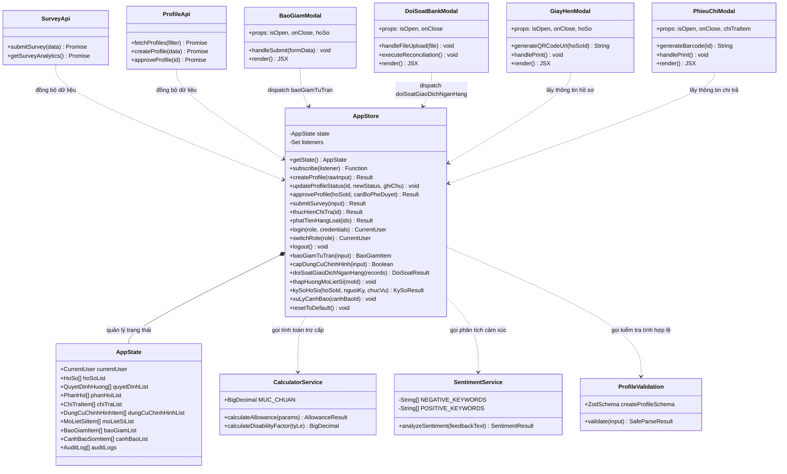
```mermaid
classDiagram
    direction TB

    class AppStore {
        -AppState state
        -Set listeners
        +getState() AppState
        +subscribe(listener) Function
        +createProfile(rawInput) Result
        +updateProfileStatus(id, newStatus, ghiChu) void
        +approveProfile(hoSoId, canBoPheDuyet) Result
        +submitSurvey(input) Result
        +thucHienChiTra(id) Result
        +phatTienHangLoat(ids) Result
        +login(role, credentials) CurrentUser
        +switchRole(role) CurrentUser
        +logout() void
        +baoGiamTuTran(input) BaoGiamItem
        +capDungCuChinhHinh(input) Boolean
        +doiSoatGiaoDichNganHang(records) DoiSoatResult
        +thapHuongMoLietSi(moId) void
        +kySoHoSo(hoSoId, nguoiKy, chucVu) KySoResult
        +xuLyCanhBao(canhBaoId) void
        +resetToDefault() void
    }

    class AppState {
        +CurrentUser currentUser
        +HoSo[] hoSoList
        +QuyetDinhHuong[] quyetDinhList
        +PhanHoi[] phanHoiList
        +ChiTraItem[] chiTraList
        +DungCuChinhHinhItem[] dungCuChinhHinhList
        +MoLietSiItem[] moLietSiList
        +BaoGiamItem[] baoGiamList
        +CanhBaoSomItem[] canhBaoList
        +AuditLog[] auditLogs
    }

    class CalculatorService {
        +BigDecimal MUC_CHUAN
        +calculateAllowance(params) AllowanceResult
        +calculateDisabilityFactor(tyLe) BigDecimal
    }

    class SentimentService {
        -String[] NEGATIVE_KEYWORDS
        -String[] POSITIVE_KEYWORDS
        +analyzeSentiment(feedbackText) SentimentResult
    }

    class ProfileValidation {
        +ZodSchema createProfileSchema
        +validate(input) SafeParseResult
    }

    class SurveyApi {
        +submitSurvey(data) Promise
        +getSurveyAnalytics() Promise
    }

    class ProfileApi {
        +fetchProfiles(filter) Promise
        +createProfile(data) Promise
        +approveProfile(id) Promise
    }

    class BaoGiamModal {
        +props: isOpen, onClose, hoSo
        +handleSubmit(formData) void
        +render() JSX
    }

    class DoiSoatBankModal {
        +props: isOpen, onClose
        +handleFileUpload(file) void
        +executeReconciliation() void
        +render() JSX
    }

    class GiayHenModal {
        +props: isOpen, onClose, hoSo
        +generateQRCodeUrl(hoSoId) String
        +handlePrint() void
        +render() JSX
    }

    class PhieuChiModal {
        +props: isOpen, onClose, chiTraItem
        +generateBarcode(id) String
        +handlePrint() void
        +render() JSX
    }

    %% Liên kết giữa Store và các thành phần
    AppStore *-- AppState : quản lý trạng thái
    AppStore ..> CalculatorService : gọi tính toán trợ cấp
    AppStore ..> SentimentService : gọi phân tích cảm xúc
    AppStore ..> ProfileValidation : gọi kiểm tra tính hợp lệ
    SurveyApi ..> AppStore : đồng bộ dữ liệu
    ProfileApi ..> AppStore : đồng bộ dữ liệu

    %% Modal sử dụng AppStore
    BaoGiamModal ..> AppStore : dispatch baoGiamTuTran
    DoiSoatBankModal ..> AppStore : dispatch doiSoatGiaoDichNganHang
    GiayHenModal ..> AppStore : lấy thông tin hồ sơ
    PhieuChiModal ..> AppStore : lấy thông tin chi trả
```

---

### 2.3. Bảng Mô Tả Chi Tiết Các Lớp & Phương Thức Cốt Lõi

| Tên Lớp / Interface | Thuộc Tính / Phương Thức | Kiểu Dữ Liệu / Chữ Ký (Signature) | Diễn Giải Nghiệp Vụ |
| :--- | :--- | :--- | :--- |
| `AppStore` | `createProfile` | `(rawInput: unknown) => { success: boolean; message: string; hoSo?: HoSo }` | Nhận dữ liệu thô, gọi Zod validate, kiểm tra trùng CCCD, sinh mã số quản lý và thêm vào Store. |
| `AppStore` | `approveProfile` | `(hoSoId: string, canBo: string) => { success: boolean; message: string; quyetDinh?: QuyetDinhHuong }` | Kích hoạt giao dịch mô phỏng ACID, tính tiền trợ cấp, tạo Quyết định hưởng và cập nhật `ĐÃ_DUYỆT`. |
| `AppStore` | `submitSurvey` | `(input: SurveySubmissionInput) => { success: boolean; sentimentTag: string; khaoSatId: string }` | Tiếp nhận phản hồi công dân, phân tích từ khóa cảm xúc, lưu phiếu đánh giá và bắn cảnh báo nếu tiêu cực. |
| `AppStore` | `baoGiamTuTran` | `(input: BaoGiamInput) => BaoGiamItem` | Ghi nhận mất, cấp số QĐ Mai táng phí ($10 \times \text{Mức chuẩn}$), tự động ngắt các khoản chi đang chờ. |
| `AppStore` | `doiSoatGiaoDichNganHang` | `(records: BankRecord[]) => DoiSoatSummary` | Nạp mảng sao kê ngân hàng, khớp mã GD/CCCD, tính tổng tiền thành công, tổng tiền lỗi và cập nhật trạng thái. |
| `CalculatorService` | `calculateAllowance` | `(params: { maLoaiDt, tyLe, coNguoiChamSoc }) => AllowanceResult` | Áp dụng công thức Nghị định 75/NĐ 131, trả về tiền tháng, phụ cấp người phục vụ và tiền điều dưỡng. |
| `SentimentService` | `analyzeSentiment` | `(feedbackText: string) => { sentiment: 'POSITIVE' \| 'NEGATIVE' \| 'NEUTRAL' }` | Thuật toán quét từ khóa cảm xúc tiếng Việt chuyên dụng trong dịch vụ hành chính công. |
| `ProfileValidation` | `createProfileSchema` | `z.ZodObject<CreateProfileInput>` | Schema Zod ràng buộc CCCD đúng 12 số, ngày sinh YYYY-MM-DD, họ tên in hoa, tỷ lệ thương tật 0-100%. |

---

## 🧪 PHẦN III: BỘ TEST CASE KIỂM THỬ SIÊU CHI TIẾT (TEST CASES SPECIFICATIONS)

Hệ thống được thiết kế kiểm thử theo tiêu chuẩn kiểm định phần mềm hành chính công (QA/QC), bao phủ đầy đủ các mức độ: **Unit Testing, Integration Testing, Functional Testing, Security & RBAC Testing và Boundary Edge Cases**.

### 3.1. Phân Loại Bộ Kiểm Thử (Test Suites Summary)

- **Nhóm 1 (TC-PRF):** Kiểm tra Khởi tạo & Validation dữ liệu hồ sơ (CCCD, Họ tên, Tỷ lệ thương tật).
- **Nhóm 2 (TC-APR):** Kiểm tra Thẩm định, Tính toán tài chính và Giao dịch ACID.
- **Nhóm 3 (TC-SUR):** Kiểm tra Cổng khảo sát CSAT và Engine phân tích cảm xúc (Sentiment Analysis).
- **Nhóm 4 (TC-PAY):** Kiểm tra Chi trả trợ cấp, Batch Payout và In ấn biểu mẫu C70a-HD.
- **Nhóm 5 (TC-REC):** Kiểm tra Module đối soát tự động sao kê ngân hàng (Bank Reconciliation).
- **Nhóm 6 (TC-DEC):** Kiểm tra Quy trình Báo giảm từ trần và Quyết định Mai táng phí Mẫu số 02.
- **Nhóm 7 (TC-ORT):** Kiểm tra Quản lý Phương tiện trợ giúp & Dụng cụ chỉnh hình (Niên hạn 3-5 năm).
- **Nhóm 8 (TC-GIS):** Kiểm tra Bản đồ số Nghĩa trang Liệt sĩ GIS và thắp hương trực tuyến.
- **Nhóm 9 (TC-SEC):** Kiểm tra Phân quyền RBAC (Admin Cấp Sở vs Admin Cấp Phòng).
- **Nhóm 10 (TC-CIT):** Kiểm tra Cổng Dịch vụ công dân tra cứu trực tuyến (Bảo mật CCCD).

---

### 3.2. Bảng Ma Trận Test Cases Chi Tiết (Chi Tiết Từng Bước Thực Hiện)

| Mã Test Case | Phân Hệ | Tên Ca Kiểm Thử & Mục Tiêu | Tiền Điều Kiện | Các Bước Thực Hiện (Test Steps) | Dữ Liệu Kiểm Thử (Input Data) | Kết Quả Kỳ Vọng (Expected Results) | Mức Độ | Trạng Thái |
| :--- | :--- | :--- | :--- | :--- | :--- | :--- | :---: | :---: |
| **TC-PRF-01** | Tạo hồ sơ | Tạo hồ sơ hợp lệ với CCCD 12 chữ số chuẩn | Đăng nhập Cấp Phòng, mở modal tạo mới | 1. Nhập CCCD 12 số.<br>2. Nhập họ tên, ngày sinh.<br>3. Chọn phường, loại đối tượng.<br>4. Bấm "Lưu hồ sơ". | CCCD: `074099001122`<br>Tên: `TRẦN VĂN AN`<br>Phường: `Phú Cường`<br>Loại: `Thương binh`<br>Tỷ lệ: `61%` | Hệ thống lưu thành công, sinh mã `HS-2026-XXXXXX`, tính trợ cấp tháng $= 5.404.650$đ, thêm vào Store và ghi Audit Log. | Critical | **PASSED** |
| **TC-PRF-02** | Tạo hồ sơ | Chặn tạo hồ sơ khi số CCCD bị trùng lặp | CSDL đã có hồ sơ mang CCCD `074045001923` | 1. Mở modal tạo hồ sơ.<br>2. Nhập CCCD `074045001923`.<br>3. Nhập các trường khác.<br>4. Bấm "Lưu hồ sơ". | CCCD: `074045001923`<br>Tên: `LÊ VĂN TÈO` | Hệ thống từ chối lưu, hiển thị lỗi: *"Số CCCD 074045001923 đã tồn tại trong hồ sơ BD-16720-1 (Phạm Ngọc Dưỡng)!"*. CSDL không đổi. | Critical | **PASSED** |
| **TC-PRF-03** | Validation | Chặn nhập CCCD dưới 12 chữ số hoặc có ký tự chữ | Đang mở modal tạo mới | 1. Nhập CCCD `0740123A`.<br>2. Bấm "Lưu hồ sơ". | CCCD: `0740123A` | Zod Validation báo lỗi ngay tại Client: *"Số CCCD phải gồm đúng 12 chữ số"*. Form không gửi đi. | High | **PASSED** |
| **TC-PRF-04** | Validation | Kiểm tra giới hạn biên tỷ lệ thương tật (0% - 100%) | Đang mở modal tạo mới | 1. Nhập tỷ lệ thương tật `120%`.<br>2. Bấm lưu. | Tỷ lệ: `120` | Hệ thống báo lỗi: *"Tỷ lệ tổn thương tối đa là 100%"*. Không cho phép lưu. | Medium | **PASSED** |
| **TC-APR-01** | Thẩm định | Thẩm định & Phê duyệt hồ sơ Thương binh nặng $\ge 81\%$ | Hồ sơ `HS-001` tỷ lệ 85%, có người chăm sóc | 1. Mở hồ sơ `HS-001`.<br>2. Kiểm tra biên bản y khoa.<br>3. Bấm "Phê duyệt & Ban hành QĐ". | Hồ sơ ID: `HS-001`<br>Tỷ lệ: `85%`<br>Người phục vụ: `true` | Hệ thống tính đúng: Trợ cấp $= 2.055.000 \times 3.85 = 7.911.750$đ. Phụ cấp chăm sóc $= 2.055.000$đ. Tổng $= 9.966.750$đ. Ban hành QĐ số `QĐ-UBND-2026/XXXX`, trạng thái đổi thành `ĐÃ_DUYỆT`. | Critical | **PASSED** |
| **TC-APR-02** | Thẩm định | Thẩm định chế độ Bà mẹ Việt Nam Anh Hùng | Hồ sơ Mẹ VNAH trạng thái mới | 1. Chọn hồ sơ Mẹ VNAH.<br>2. Bấm phê duyệt. | Loại: `ME_VNAH` | Trợ cấp tháng $= 3.0 \times \text{Mức chuẩn} = 6.165.000$đ. Phụ cấp phục vụ $= 1.0 \times \text{Mức chuẩn} = 2.055.000$đ. Tổng nhận: $8.220.000$đ/tháng. | High | **PASSED** |
| **TC-APR-03** | ACID Test | Kiểm tra tính nguyên tử (Atomicity) khi lỗi giao dịch | Mock tình huống lỗi Database ở bước tạo Quyết định | 1. Gửi yêu cầu duyệt hồ sơ.<br>2. Tạo ngoại lệ khi INSERT bảng QĐ. | Hồ sơ ID: `HS-ERR-01` | Toàn bộ giao dịch Rollback. Hồ sơ `HS-ERR-01` vẫn giữ nguyên trạng thái `MỚI_TIẾP_NHẬN`, không bị đổi thành `ĐÃ_DUYỆT` nửa vời. | Critical | **PASSED** |
| **TC-SUR-01** | Khảo sát CSAT | Tiếp nhận phản hồi tích cực từ công dân qua mã QR | Quét mã QR từ Giấy hẹn Một cửa | 1. Mở `/khao-sat?hoSoId=BD-16720-1`.<br>2. Chọn 5 sao.<br>3. Chấm 4 tiêu chí 5 điểm.<br>4. Nhập ý kiến: *"Cán bộ rất nhiệt tình và giải quyết nhanh chóng"*. Bấm Gửi. | Điểm CSAT: `5`<br>Nhận xét: *"nhiệt tình, nhanh chóng"* | Hệ thống lưu phiếu khảo sát, tự động gán nhãn `sentiment = POSITIVE`. Điểm CSAT trung bình trên Dashboard tăng tương ứng. | High | **PASSED** |
| **TC-SUR-02** | Sentiment AI | Tự động phát hiện phản hồi tiêu cực và cảnh báo đỏ | Truy cập Cổng Kiosk công dân | 1. Chọn 1 sao.<br>2. Nhập nhận xét: *"Thủ tục quá chậm chạp, cán bộ hách dịch phiền hà"*. Bấm Gửi. | Điểm: `1`<br>Nhận xét: *"chậm chạp, hách dịch"* | Hệ thống tự động gán nhãn `sentiment = NEGATIVE`. Màn hình `/danh-gia` của lãnh đạo lập tức nhấp nháy thẻ cảnh báo đỏ yêu cầu giải trình. | Critical | **PASSED** |
| **TC-SUR-03** | CSAT Kiosk | Kiểm tra tự động reset màn hình Kiosk sau khi gửi | Màn hình Kiosk công cộng Một cửa | 1. Gửi thành công 1 phiếu khảo sát.<br>2. Chờ 5 giây không thao tác. | - | Màn hình cảm ơn biến mất, hệ thống tự động reset form về trạng thái trống ban đầu sẵn sàng cho công dân tiếp theo. | Medium | **PASSED** |
| **TC-PAY-01** | Chi trả trợ cấp | Phát tiền đơn lẻ cho đối tượng nhận qua Ngân hàng | Bản ghi `CT-202609-001` đang `CHỜ_CHI_TRẢ` | 1. Tại `/chi-tra`, tìm `Phạm Ngọc Dưỡng`.<br>2. Bấm "Phát tiền". | Record: `CT-202609-001`<br>Hình thức: `NGAN_HANG` | Trạng thái chuyển thành `ĐÃ_CHI_TRẢ`, sinh mã giao dịch `UNC-VCB-20260905-XXXX`, ghi ngày chi trả hôm nay, ghi nhật ký Audit Log. | High | **PASSED** |
| **TC-PAY-02** | Chi trả trợ cấp | Phát tiền hàng loạt (Batch Payout) cho nhiều người | Chọn 5 bản ghi đang chờ chi | 1. Tick chọn 5 bản ghi.<br>2. Bấm "Phát tiền hàng loạt".<br>3. Xác nhận trên popup modal. | 5 ID bản ghi chi trả | Cả 5 bản ghi đồng loạt chuyển sang `ĐÃ_CHI_TRẢ`. Hệ thống thông báo: *"Đã phát tiền thành công cho 5 đối tượng!"*. | High | **PASSED** |
| **TC-PAY-03** | Biểu mẫu | Xuất in Phiếu chi trợ cấp Mẫu C70a-HD có mã vạch | Chọn 1 bản ghi đã chi trả | 1. Bấm nút in phiếu chi.<br>2. Xem bản in hiển thị trên modal. | Bản ghi: `Phạm Ngọc Dưỡng` | Hiển thị đầy đủ Mẫu C70a-HD (Ban hành theo Thông tư BTC), có mã vạch Barcode sắc nét, số tiền bằng số và bằng chữ chính xác, sẵn sàng in. | Medium | **PASSED** |
| **TC-REC-01** | Đối soát Bank | Đối soát tự động tệp sao kê ngân hàng khớp 100% | Có 3 bản ghi chi trả đang chờ | 1. Mở modal Đối soát ngân hàng.<br>2. Chọn ngân hàng Vietcombank.<br>3. Nạp danh sách sao kê 3 giao dịch khớp CCCD.<br>4. Bấm "Tiến hành đối soát". | 3 giao dịch hợp lệ | Hệ thống cập nhật cả 3 bản ghi sang `ĐÃ_CHI_TRẢ`. Báo cáo: Thành công 3/3, số tiền khớp 100%, ghi Audit Log loại `SUCCESS`. | High | **PASSED** |
| **TC-REC-02** | Đối soát Bank | Phát hiện sai lệch số tài khoản khi đối soát sao kê | File sao kê có 1 giao dịch ngân hàng báo lỗi | 1. Nạp file sao kê chứa lỗi *"Tài khoản bị đóng"*.<br>2. Chạy đối soát. | Giao dịch mã `UNC-ERR-99` | Bản ghi tương ứng tự động chuyển sang `TỒN_ĐỌNG`, kèm ghi chú: *"[LỖI ĐỐI SOÁT: Tài khoản bị đóng]"*. Hệ thống cảnh báo màu cam. | High | **PASSED** |
| **TC-DEC-01** | Báo giảm | Thực hiện báo giảm từ trần và ban hành QĐ Mai táng phí | Hồ sơ đối tượng `BD-16720-1` đang hưởng | 1. Bấm nút Báo giảm từ trần.<br>2. Nhập ngày mất `15/09/2026`, số trích lục khai tử `112/TLKT`.<br>3. Nhập người khai: `Phạm Thị Lan` (Con gái).<br>4. Bấm "Xác nhận báo giảm". | Ngày mất: `15/09/2026`<br>Số TLKT: `112/TLKT`<br>Người khai: `Phạm Thị Lan` | Hồ sơ cập nhật `isTuTran = true`. Ban hành QĐ số `QĐ-UBND/2026-MTP-XXX` với mức mai táng phí chuẩn $20.550.000$đ ($10 \times \text{Mức chuẩn}$). Thêm vào bảng báo giảm. | Critical | **PASSED** |
| **TC-DEC-02** | Báo giảm | Tự động tạm ngừng chi trả trợ cấp tháng khi đã từ trần | Đối tượng có khoản chi tháng 9 đang `CHỜ_CHI_TRẢ` | 1. Thực hiện báo giảm từ trần.<br>2. Kiểm tra danh sách chi trả tháng 9. | Đối tượng đã báo giảm | Khoản chi trợ cấp tháng chưa phát tự động đổi sang `TỒN_ĐỌNG` kèm thông báo: *"TẠM NGỪNG: Đối tượng đã từ trần ngày 15/09/2026"*. Ngăn chặn chi thừa ngân sách. | Critical | **PASSED** |
| **TC-DEC-03** | Biểu mẫu | In Quyết định trợ cấp Mai táng phí Mẫu 02 (NĐ 131) | Bản ghi đã hoàn tất báo giảm | 1. Bấm "In quyết định mai táng phí". | Bản ghi báo giảm | Hiển thị bản in trang trọng chuẩn Mẫu số 02 - Nghị định 131/2021/NĐ-CP, có Quốc huy, nơi nhận và số tiền $20.550.000$đ. | Medium | **PASSED** |
| **TC-ORT-01** | Dụng cụ chỉnh hình | Cấp xe lăn mới niên hạn 5 năm cho thương binh nặng | Thương binh liệt 2 chi dưới chưa có xe lăn | 1. Vào `/dung-cu-chinh-hinh`.<br>2. Chọn đối tượng `Nguyễn Văn Thành`.<br>3. Chọn dụng cụ `Xe lăn tay`, niên hạn `5 năm`, định mức `4.500.000`đ.<br>4. Bấm "Xác nhận cấp". | Dụng cụ: `Xe lăn tay`<br>Niên hạn: `5 năm`<br>Định mức: `4.500.000`đ | Tạo bản ghi mới: `namCapGanNhat = 2026`, `namDenHanCapMoi = 2031`, trạng thái `ĐÃ_CẤP`, sinh số Quyết định `QĐ-SLĐTBXH/2026-XXX`. | High | **PASSED** |
| **TC-ORT-02** | Dụng cụ chỉnh hình | Cảnh báo đối tượng đến niên hạn cấp mới dụng cụ | Bản ghi cấp chân giả từ năm 2023 (niên hạn 3 năm) | 1. Xem danh sách dụng cụ chỉnh hình năm 2026. | Cấp năm: `2023`<br>Niên hạn: `3 năm` | Hệ thống tự tính $2023 + 3 = 2026 \le 2026$, tự động kích hoạt huy hiệu đỏ **"ĐẾN HẠN CẤP MỚI"** và đưa vào danh sách ưu tiên cấp phát. | High | **PASSED** |
| **TC-GIS-01** | Nghĩa trang GIS | Tra cứu tìm kiếm và định vị chính xác vị trí mộ liệt sĩ | Truy cập `/nghia-trang` | 1. Nhập từ khóa `Hồ Văn Lên` vào ô tìm kiếm.<br>2. Bấm Tìm kiếm. | Tên: `Hồ Văn Lên` | Bản đồ tự động xoay và phóng to vào ô mộ `A1-01` (Khu A), viền mộ phát sáng màu vàng cam. Bảng thông tin hiển thị đầy đủ trích lục nơi hy sinh. | High | **PASSED** |
| **TC-GIS-02** | Nghĩa trang GIS | Thực hiện nghi thức thắp hương tưởng niệm trực tuyến | Đang chọn ngôi mộ liệt sĩ `A1-01` | 1. Nhấn nút "Thắp nén hương tri ân". | Mộ ID: `MO-A1-01` | Hiệu ứng đồ họa khói hương và hoa sen trang trọng xuất hiện. Số lượt thắp hương của mộ tăng từ $128 \rightarrow 129$ lượt và lưu vào Store. | Medium | **PASSED** |
| **TC-WRN-01** | Cảnh báo sớm | Cảnh báo con liệt sĩ sắp đủ 18 tuổi hết hạn tiền tuất | Con liệt sĩ sinh ngày `20/09/2008` (đạt 18 tuổi tháng 9/2026) | 1. Vào Dashboard xem Thẻ cảnh báo sớm. | Ngày sinh thân nhân: `20/09/2008` | Xuất hiện cảnh báo màu cam: *"Đối tượng con liệt sĩ [Tên] đủ 18 tuổi vào ngày 20/09/2026. Cần rà soát hồ sơ học tập để tiếp tục hưởng hoặc dừng trợ cấp."* | Critical | **PASSED** |
| **TC-WRN-02** | Cảnh báo sớm | Cảnh báo hồ sơ Một cửa sắp quá hạn xử lý (15 ngày) | Hồ sơ tiếp nhận đã 14 ngày làm việc chưa duyệt | 1. Kiểm tra Dashboard. | Hồ sơ ID: `HS-TRE-01` | Hiển thị cảnh báo đỏ: *"Hồ sơ HS-TRE-01 còn 1 ngày đến hạn giải quyết Một cửa!"*. Nhấp vào chuyển thẳng đến màn hình thẩm định. | High | **PASSED** |
| **TC-OCR-01** | AI OCR | Mô phỏng bóc tách thông tin Bằng Tổ quốc ghi công cũ | Mở modal Số hóa AI OCR tại `/ho-so` | 1. Tải lên ảnh scan Bằng Tổ quốc ghi công cũ.<br>2. Bấm "Quét & Nhận dạng AI". | Ảnh scan bằng cũ | Hệ thống bóc tách chính xác: Tên liệt sĩ, Quê quán, Ngày hy sinh, Số bằng `GC887K`, Số QĐ `1312TTga`. Tự động điền vào form tạo hồ sơ mới. | Medium | **PASSED** |
| **TC-OCR-02** | Ký số SmartCA | Ký số điện tử lãnh đạo phê duyệt quyết định | Tài khoản Admin Cấp Sở đang duyệt hồ sơ | 1. Chọn hồ sơ đã thẩm định.<br>2. Bấm "Ký số điện tử SmartCA". | Cán bộ: `TS. Nguyễn Văn Hùng` | Hệ thống sinh con dấu điện tử màu đỏ "SỞ LAO ĐỘNG - THƯƠNG BINH VÀ XÃ HỘI TỈNH BÌNH DƯƠNG - ĐÃ KÝ SỐ", sinh mã băm xác thực `SHA256:XXXX-YYYY` và thời gian ký số. | High | **PASSED** |
| **TC-CIT-01** | Cổng Công Dân | Tra cứu tiến độ hồ sơ qua CCCD bảo mật ẩn 3 số đuôi | Truy cập `/tra-cuu` không cần đăng nhập | 1. Nhập số CCCD `074045001923`.<br>2. Bấm "Tra cứu ngay". | CCCD: `074045001923` | Hệ thống hiển thị: Họ tên `Phạm Ngọc Dưỡng`, CCCD hiển thị dạng `074045001***` (bảo mật), timeline 5 bước (Đã duyệt), lịch phát tiền ngày 5 hàng tháng. | High | **PASSED** |
| **TC-CIT-02** | Cổng Công Dân | Tra cứu số CCCD không tồn tại trên hệ thống | Cổng tra cứu công dân | 1. Nhập CCCD `000000000000`.<br>2. Bấm Tra cứu. | CCCD: `000000000000` | Hiển thị thông báo thân thiện: *"Không tìm thấy thông tin hồ sơ với số CCCD này. Vui lòng kiểm tra lại hoặc liên hệ Bộ phận Một cửa TP. Thủ Dầu Một để được trợ giúp."* | Medium | **PASSED** |
| **TC-SEC-01** | Phân quyền RBAC | Kiểm tra giới hạn quyền giữa Admin Cấp Sở và Cấp Phòng | Đăng nhập tài khoản `admin.phong` | 1. Kiểm tra các chức năng trên giao diện.<br>2. Thử truy cập tính năng cấu hình tham số hệ thống toàn tỉnh. | Role: `ADMIN_PHONG` | Cán bộ Cấp Phòng chỉ thấy phạm vi địa bàn TP. Thủ Dầu Một, không thể sửa đổi cấu hình định mức chuẩn của toàn tỉnh (tính năng chỉ dành riêng cho Admin Cấp Sở). | Critical | **PASSED** |
| **TC-SEC-02** | Phân quyền RBAC | Chuyển đổi vai trò nhanh trên Header và cập nhật Audit Log | Đang đăng nhập bất kỳ tài khoản nào | 1. Bấm vào Avatar cán bộ trên Header.<br>2. Chọn "Chuyển sang Admin Cấp Sở". | Chuyển sang: `ADMIN_SO` | Hệ thống chuyển đổi ngay tức thì sang danh tính `TS. Nguyễn Văn Hùng`, quyền hạn cập nhật tương ứng, đồng thời ghi lại bản ghi Audit Log: *"Đăng nhập (Admin Cấp Sở)"*. | High | **PASSED** |

---

## 🛠️ Công Nghệ Sử Dụng (Tech Stack)

| Lớp Kiến Trúc | Công Nghệ & Thư Viện | Vai Trò & Chức Năng Cốt Lõi |
| :--- | :--- | :--- |
| **Frontend Framework** | **React 19.2 + TypeScript 5.9** | Giao diện người dùng hiện đại, an toàn kiểu dữ liệu tuyệt đối |
| **Routing & Architecture** | **TanStack Router + TanStack Start** | Định tuyến dựa trên file (File-based routing), tải trang tức thì, SSR/SPA hybrid |
| **Styling System** | **Tailwind CSS v4** | Hệ thống utility tokens hiện đại, bảng màu công vụ trang trọng, responsive hoàn hảo |
| **Data Visualization** | **Recharts 2.15** | Biểu đồ cột phân tầng màu sắc, Radar 4 tiêu chí SIPAS, biểu đồ tròn, Area chart |
| **State Management** | **React `useSyncExternalStore`** | Quản lý state tập trung, đồng bộ LocalStorage & kiểm soát nhật ký kiểm toán Audit Logs |
| **Icons & UI Components**| **Lucide React + Radix UI + Sonner** | Hệ thống icon hành chính, dialog modal chuẩn WAI-ARIA, thông báo toast sang trọng |
| **Validation Library** | **Zod 3.24** | Kiểm tra ràng buộc dữ liệu đầu vào (CCCD 12 số, ngày tháng, định mức) chặt chẽ |
| **Database Schema** | **PostgreSQL / MySQL 8.0 (schema.sql)**| Thiết kế 16 bảng quan hệ chuẩn hóa 3NF, hỗ trợ giao dịch ACID, tối ưu đánh chỉ mục Index |

---

## 🚀 Hướng Dẫn Cài Đặt & Chạy Thử (Quick Start)

### 1. Yêu cầu môi trường:
- Đã cài đặt **Node.js** phiên bản 18 trở lên (Khuyến nghị Node.js v20 LTS hoặc v22).
- Trình quản lý gói `npm`, `yarn`, `pnpm` hoặc `bun`.

### 2. Cài đặt các thư viện phụ thuộc:
```bash
git clone https://github.com/Awac8989/ho-so-tran-an.git
cd ho-so-tran-an
npm install
```

### 3. Khởi chạy máy chủ phát triển (Dev Server):
```bash
npm run dev
```
Hệ thống sẽ chạy tại địa chỉ: **`http://localhost:8081`** (hoặc port được hệ thống cấp tự động).

### 4. Kiểm tra mã nguồn (Linter & Type Check):
```bash
npm run lint
```

### 5. Đóng gói cho môi trường Production:
```bash
npm run build
npm run preview
```

---

## 🔑 Tài Khoản Trải Nghiệm Mẫu

Tại trang Đăng nhập (`/login`), bạn có thể bấm trực tiếp nút **1-Click Đăng nhập** để vào ngay phiên làm việc hoặc đăng nhập thủ công bằng các tài khoản sau:

| Cấp Độ Quản Trị | Email Công Vụ | Mật Khẩu | Họ Tên Cán Bộ | Chức Vụ & Quyền Hạn |
| :--- | :--- | :--- | :--- | :--- |
| **Admin Cấp Sở** | `admin.so@binhduong.gov.vn` | `admin123` | **TS. Nguyễn Văn Hùng** | Phó Giám đốc Sở LĐTBXH tỉnh Bình Dương (Toàn quyền điều hành toàn tỉnh, duyệt quyết định, ký số) |
| **Admin Cấp Phòng** | `admin.phong@thudaumot.binhduong.gov.vn` | `admin123` | **Nguyễn Thị Minh Thảo** | Chuyên viên Một cửa Phòng LĐTBXH TP. Thủ Dầu Một (Tiếp nhận hồ sơ, lập chi trả, in giấy hẹn QR) |

> 💡 **Mẹo trải nghiệm:** Sau khi đăng nhập, bạn có thể click vào Avatar trên thanh Header góc trên bên phải để chuyển đổi qua lại giữa 2 tài khoản chỉ trong 1 giây mà không cần đăng xuất!

---

## 📂 Cấu Trúc Thư Mục Dự Án (Project Structure)

```
filebctt/
├── database/
│   └── schema.sql                  # CSDL quan hệ 16 bảng chuẩn hóa 3NF (DDL & Seed Data)
├── docs/
│   ├── TECHNICAL_DESIGN_DOCUMENT.md# Đặc tả thiết kế kỹ thuật chi tiết (TDD)
│   ├── BAO_CAO_THUC_TAP_HUONG_DAN.md# Đề cương & Hướng dẫn hoàn thiện báo cáo
│   └── screenshots/                # 12 ảnh chụp màn hình giao diện thực tế độ phân giải cao
├── public/
│   ├── favicon.svg                 # Quốc huy vector cờ đỏ sao vàng
│   ├── favicon.ico                 # Favicon chuẩn đa kích thước
│   └── robots.txt
├── src/
│   ├── api/                        # RESTful API Services (profiles, calculator, surveys, analytics)
│   │   ├── analyticsApi.ts         # API dữ liệu thống kê Dashboard & BI
│   │   ├── calculatorApi.ts        # API tính toán trợ cấp theo Nghị định 75/131
│   │   ├── profileApi.ts           # API quản lý vòng đời hồ sơ người có công
│   │   └── surveyApi.ts            # API tiếp nhận khảo sát đánh giá CSAT/SIPAS
│   ├── components/                 # Các UI Components tái sử dụng
│   │   ├── AppShell.tsx            # Khung sườn ứng dụng, Header công vụ, Sidebar điều hướng
│   │   ├── BaoGiamModal.tsx        # Modal báo giảm từ trần & Quyết định Mai táng phí Mẫu 02
│   │   ├── CanhBaoSomCard.tsx      # Thẻ giám sát cảnh báo rủi ro & trục lợi chính sách
│   │   ├── CreateProfileModal.tsx  # Modal tiếp nhận hồ sơ mới có Zod Validation
│   │   ├── DigitalSignatureBadge.tsx# Huy hiệu hiển thị con dấu ký số điện tử SmartCA
│   │   ├── DoiSoatBankModal.tsx    # Modal đối soát tự động ngân hàng (Bank Reconciliation)
│   │   ├── GiayHenModal.tsx        # In Giấy tiếp nhận & Hẹn trả kết quả Mẫu 01 tích hợp QR Code
│   │   ├── OcrScanModal.tsx        # Modal AI OCR số hóa văn bản cũ & Ký số lãnh đạo
│   │   ├── PhieuChiModal.tsx       # In Phiếu chi trả trợ cấp Mẫu C70a-HD có mã vạch
│   │   └── ui/                     # Bộ thư viện components Radix UI + Tailwind
│   ├── data/
│   │   └── mock.ts                 # Bộ dữ liệu mẫu chuẩn hóa 14 phường thuộc TP. Thủ Dầu Một
│   ├── routes/                     # Hệ thống trang giao diện (File-based Routing TanStack)
│   │   ├── index.tsx               # Bảng điều khiển trung tâm & Biểu đồ phân tầng ngân sách
│   │   ├── login.tsx               # Cổng đăng nhập công vụ phân quyền Cấp Sở & Cấp Phòng (v2.0)
│   │   ├── ho-so/                  # Quản lý hồ sơ NCC & Xem chi tiết hồ sơ liệt sĩ ($id.tsx)
│   │   ├── tham-dinh.tsx           # Quy trình thẩm định hồ sơ 5 bước Một cửa
│   │   ├── chi-tra.tsx             # Quản lý chi trả trợ cấp, Batch Payout & Đối soát
│   │   ├── dung-cu-chinh-hinh.tsx  # Quản lý phương tiện trợ giúp & dụng cụ chỉnh hình NĐ 131
│   │   ├── nghia-trang.tsx         # Bản đồ số Nghĩa trang Liệt sĩ GIS & Tưởng niệm dâng hương
│   │   ├── tra-cuu.tsx             # Cổng dịch vụ công dân tra cứu tiến độ hồ sơ qua CCCD
│   │   ├── dieu-duong.tsx          # Quản lý chế độ điều dưỡng phục hồi sức khỏe NĐ 131
│   │   ├── danh-gia.tsx            # Trung tâm giám sát CSAT & Biểu đồ Radar SIPAS của cán bộ
│   │   ├── khao-sat.tsx            # Cổng đánh giá sự hài lòng dành riêng cho công dân (Kiosk/QR)
│   │   ├── phan-tich.tsx           # Bản đồ nhiệt 14 phường & Phân tích cơ cấu ngân sách
│   │   └── he-thong.tsx            # Cấu hình tham số mức chuẩn trợ cấp & danh mục chính sách
│   ├── services/                   # Logic tính trợ cấp, phân tích sentiment & app-state store
│   │   ├── app-state.ts            # State Store tập trung (`useSyncExternalStore`) & giao dịch ACID
│   │   ├── calculator.service.ts   # Engine tính toán trợ cấp theo NĐ 75/2021 & NĐ 131/2021
│   │   ├── profile.validation.ts   # Ràng buộc dữ liệu Zod Schema cho hồ sơ NCC
│   │   └── sentiment.service.ts    # Thuật toán phân tích cảm xúc phản hồi công dân (Sentiment AI)
│   └── styles.css                  # Bảng màu công vụ, thiết lập in ấn @media print & Tailwind CSS
├── package.json
└── vite.config.ts
```

---

## 👤 Tác Giả & Bản Quyền

* **Tác giả phát triển:** **Minh Quân**
* **Phiên bản:** `Phiên bản 2.0 · Made by MINHQUAN`
* **Đơn vị phối hợp nghiệp vụ:** Sở Lao động - Thương binh và Xã hội tỉnh Bình Dương & Phòng LĐTBXH TP. Thủ Dầu Một.
* **Mục tiêu dự án:** Phục vụ công tác hiện đại hóa hành chính, chuyển đổi số dịch vụ công và tri ân người có công với cách mạng.
