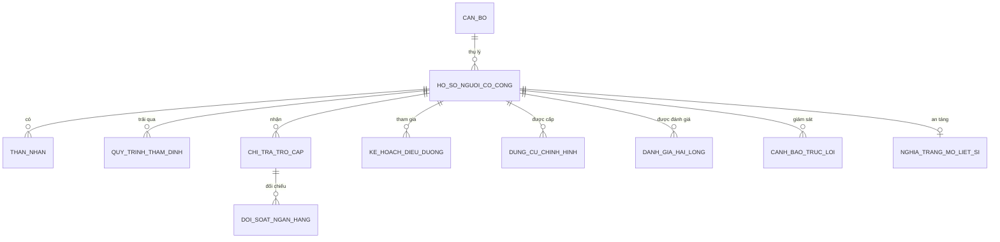

# 🏛️ HỆ THỐNG QUẢN LÝ HỒ SƠ NGƯỜI CÓ CÔNG & ĐÁNH GIÁ DỊCH VỤ CÔNG
### Sở Lao động - Thương binh và Xã hội tỉnh Bình Dương · Phòng LĐTBXH TP. Thủ Dầu Một

[](https://github.com/Awac8989/ho-so-tran-an)
[](https://react.dev)
[](https://tanstack.com/router)
[](https://tailwindcss.com)
[](https://www.typescriptlang.org)
[](https://vitejs.dev)
[](https://thuvienphapluat.vn)

---

## 📖 Giới Thiệu Dự Án

Xuất phát từ thực tiễn công tác giải quyết chế độ chính sách cho Người có công với cách mạng tại địa bàn tỉnh Bình Dương (trọng tâm là TP. Thủ Dầu Một), việc quản lý hồ sơ trước đây còn gặp nhiều thách thức: hồ sơ giấy qua nhiều thời kỳ bị xuống cấp, việc đối soát chi trả trợ cấp hàng tháng qua Ngân hàng / Bưu điện mất nhiều thời gian, công tác theo dõi niên hạn dụng cụ chỉnh hình và lập danh sách điều dưỡng dễ sai sót định mức, và chưa có kênh số hóa để lắng nghe phản hồi của người dân sau khi làm thủ tục tại Bộ phận Một cửa.

**Hệ thống Quản lý Hồ sơ Người có công & Đánh giá Dịch vụ công (Phiên bản 2.0)** được tác giả **Minh Quân** nghiên cứu và phát triển nhằm mang đến một giải pháp công nghệ toàn diện, hiện đại, đạt chuẩn chính quyền số và Đề án 06/CP:
- 📑 **Số hóa toàn bộ vòng đời hồ sơ Người có công:** Tiếp nhận ➔ Thẩm định điều kiện ➔ Lấy ý kiến liên ngành ➔ Phê duyệt trợ cấp ➔ Lập danh sách chi trả ➔ Điều dưỡng phục hồi sức khỏe.
- 🦿 **Quản lý Phương tiện trợ giúp & Dụng cụ chỉnh hình (`/dung-cu-chinh-hinh`):** Quản lý chân tay giả, xe lăn, máy trợ thính, theo dõi niên hạn 3 - 5 năm theo *Nghị định 131/2021/NĐ-CP*, tự động lập dự toán ngân sách và in Phiếu cấp có ký số.
- ⚰️ **Quy trình Báo giảm từ trần & Quyết định Mai táng phí (`/ho-so`):** Ngăn ngừa thất thoát ngân sách khi người hưởng qua đời, tự động ngừng chi trả từ tháng kế tiếp, tự động tính trợ cấp mai táng 10 tháng lương cơ sở (20.550.000đ) và xuất in Quyết định Mai táng phí (*Mẫu số 02 - NĐ 131/2021*).
- 🗺️ **Bản đồ số Nghĩa trang Liệt sĩ GIS (`/nghia-trang`):** Sơ đồ phân lô tương tác Khu A, B, C, D (5.420 mộ liệt sĩ), định vị hàng/mộ trực quan, hồ sơ bia mộ đá granite và tính năng dâng hoa / thắp nén hương tưởng niệm trực tuyến.
- 🔍 **Cổng Dịch vụ Tra cứu Trực tuyến Công dân (`/tra-cuu`):** Tra cứu theo số CCCD hoặc mã hồ sơ, bảo mật che ẩn định danh (`0740****923` theo *Nghị định 13/2023/NĐ-CP*), theo dõi tiến độ Một cửa 5 bước và lịch sử nhận tiền trợ cấp qua ATM.
- 🏦 **Phân hệ Đối soát Tự động Ngân hàng (Bank Reconciliation):** Nạp tệp sao kê ngân hàng (Vietcombank, BIDV, Agribank), tự động phân loại khớp lệnh, cảnh báo sai lệch STK hoặc chủ thẻ đã từ trần theo *Chỉ thị 21/CT-TTg*.
- 🚨 **Trung tâm Cảnh báo Sớm & Phòng ngừa Trục lợi:** Giám sát thời gian thực con liệt sĩ tròn 18 tuổi cần xem xét dừng tiền tuất, hồ sơ thẩm định quá hạn Một cửa, cảnh báo trùng lặp số CCCD trên địa bàn.
- ⚡ **AI OCR Số hóa tài liệu cũ & Ký số SmartCA:** Trích xuất tự động thông tin Giấy chứng nhận thương binh / Bằng Tổ quốc ghi công và tích hợp dấu mộc số hóa SmartCA/VNPT CA.
- 🖨️ **Chuẩn hóa biểu mẫu hành chính quốc gia:** Tự động tạo và in **Giấy tiếp nhận hồ sơ & Hẹn trả kết quả có Mã QR Code** (*Mẫu số 01 - Nghị định 61/2018/NĐ-CP*) và **Phiếu chi trả trợ cấp Mẫu C70a-HD**.
- 🌟 **Tách bạch kênh đánh giá CSAT / SIPAS:** Người dân quét mã QR trên điện thoại hoặc thao tác tại Kiosk cảm ứng để đánh giá độc lập; Cán bộ giám sát chỉ số hài lòng theo thời gian thực trên Bảng điều khiển riêng.
- 🔐 **Phân cấp điều hành rạch ròi:** Phân quyền giữa **Admin Cấp Sở** (quản trị toàn tỉnh) và **Admin Cấp Phòng** (thụ lý địa bàn cấp huyện/thành phố).

---

## 📸 Bộ Ảnh Chụp Giao Diện & Tính Năng Thực Tế (18 Màn Hình)

### 1. Cổng Đăng Nhập Quản Trị Công Vụ (`/login`)
Được thiết kế trang trọng với Quốc huy Việt Nam, Quốc hiệu và sắc đỏ công quyền. Hệ thống tích hợp sẵn tab chuyển đổi phân quyền giữa **Admin Cấp Sở** và **Admin Cấp Phòng**, kèm nút **1-Click Đăng nhập** giúp trải nghiệm và đánh giá hệ thống tức thì.

<p align="center">
  
  
</p>

* Dưới cùng của Cổng đăng nhập ghi nhận dấu ấn phiên bản: **`PHIÊN BẢN 2.0 MADE BY MINHQUAN`**.

---

### 2. Bảng Điều Khiển Trung Tâm & Cảnh Báo Sớm Phòng Ngừa Trục Lợi (`/`)
Trang chủ điều hành cung cấp các thẻ KPI quan trọng: Tổng số đối tượng, Kinh phí chi trả hàng tháng, Tỷ lệ hồ sơ đúng hạn, Điểm hài lòng CSAT và **Trung tâm Cảnh báo Sớm** tự động phát hiện trùng số CCCD, quá hạn một cửa và thân nhân hết tuổi hưởng tuất.


Biểu đồ cột **"Kinh phí chi trả theo phường"** được phối màu phân tầng trực quan theo 3 cấp độ ngân sách trên 14 phường/xã TP. Thủ Dầu Một:
- 🟢 **Xanh Lá Emerald (`#00a65a`)**: Kinh phí cao ($\ge 2.5$ tỷ VNĐ/tháng) như Phú Cường, Phú Hòa, Hiệp Thành.
- 🩵 **Xanh Ngọc Cyan (`#00c0ef`)**: Kinh phí trung bình ($1.5 - 2.5$ tỷ VNĐ/tháng).
- 🔵 **Xanh Lam Royal Blue (`#3c8dbc`)**: Kinh phí dưới $1.5$ tỷ VNĐ/tháng.


---

### 3. Menu Tài Khoản & Chuyển Đổi Nhanh Giữa Cấp Sở và Cấp Phòng
Cán bộ có thể xem thông tin cá nhân, chức vụ, phạm vi thẩm quyền và chuyển đổi qua lại linh hoạt giữa **Admin Cấp Sở** và **Admin Cấp Phòng** chỉ với 1 cú click ngay trên thanh Header.


---

### 4. Quản Lý Phương Tiện Trợ Giúp & Dụng Cụ Chỉnh Hình (`/dung-cu-chinh-hinh`)
Quản lý niên hạn cấp mới và cấp lại (3 - 5 năm) cho thương bệnh binh theo **Nghị định 131/2021/NĐ-CP**:
- Thống kê 4 chỉ số: Tổng đối tượng được cấp, Đến kỳ cấp lại, Quá hạn niên hạn, Tổng dự toán kinh phí.
- Lọc theo hiện trạng: Đang sử dụng, Đến kỳ cấp lại, Quá hạn.
- Lập hồ sơ cấp mới và in **Phiếu cấp phương tiện trợ giúp** chuẩn mẫu biểu hành chính có chữ ký số SmartCA.


---

### 5. Bản Đồ Số Nghĩa Trang Liệt Sĩ GIS (`/nghia-trang`)
Số hóa không gian nghĩa trang liệt sĩ tỉnh Bình Dương:
- Bản đồ phân lô tương tác SVG trực quan 4 phân khu (Khu A, Khu B, Khu C, Khu D).
- Tra cứu danh tính liệt sĩ, năm sinh, năm hy sinh, quê quán, tọa độ hàng/mộ.
- Hồ sơ bia mộ hiển thị dạng đá hoa cương granite trang trọng.
- Tính năng **Dâng hoa / Thắp nén hương tưởng niệm trực tuyến** có hiệu ứng khói hương và tự động tăng bộ đếm lượt viếng nghĩa trang.


---

### 6. Cổng Tra Cứu Dịch Vụ Công Dành Cho Công Dân (`/tra-cuu`)
Kênh dịch vụ công trực tuyến công khai dành cho thân nhân và công dân:
- Tra cứu nhanh qua số Căn cước công dân hoặc Mã hồ sơ Một cửa.
- Tuân thủ bảo vệ dữ liệu cá nhân theo **Nghị định 13/2023/NĐ-CP**: che giấu số CCCD (`0740****923`).
- Hiển thị trực quan tiến trình Một cửa 5 bước theo thời gian thực (Tiếp nhận ➔ Thẩm định ➔ Lấy ý kiến ➔ Ra quyết định ➔ Trả kết quả).
- Tra cứu lịch sử nhận tiền trợ cấp qua tài khoản ngân hàng và liên kết đánh giá dịch vụ công.


---

### 7. Quản Lý Hồ Sơ Người Có Công & Báo Giảm Mai Táng Phí (`/ho-so`)
Quản lý cơ sở dữ liệu hồ sơ người có công toàn địa bàn TP. Thủ Dầu Một:
- Bộ lọc đa tiêu chí: Loại chính sách (Liệt sĩ, Thương binh, Mẹ VNAH, Người nhiễm CĐHH), trạng thái, địa bàn phường/xã.
- Tích hợp tính năng **Báo giảm từ trần**: Tự động ngừng trợ cấp hàng tháng từ tháng kế tiếp, tự động tính mai táng phí bằng 10 tháng lương cơ sở (20.550.000đ) và xuất Quyết định Mẫu số 02 có chữ ký số điện tử.


---

### 8. Chi Trả Trợ Cấp & Đối Soát Tự Động Ngân Hàng (`/chi-tra`)
Hiện đại hóa quy trình chi trả an sinh xã hội không dùng tiền mặt theo **Chỉ thị 21/CT-TTg**:
- Theo dõi tỷ lệ chi trả qua thẻ ATM ngân hàng so với chi trả tiền mặt qua Bưu điện.
- Hỗ trợ xuất **Phiếu chi trợ cấp Mẫu C70a-HD** có mã vạch xác thực.
- Phân hệ **Đối soát tự động Ngân hàng (Bank Reconciliation)**: Nạp tệp sao kê ngân hàng (Vietcombank, BIDV, Agribank), hệ thống tự động đối chiếu số tài khoản, số tiền và phát hiện các giao dịch sai lệch hoặc tài khoản chủ thẻ đã từ trần.


---

### 9. Quy Trình Thẩm Định Hồ Sơ 5 Bước & Ký Số SmartCA (`/tham-dinh`)
Quy trình điện tử hóa công tác xét duyệt theo Nghị định 61/2018/NĐ-CP:
- 5 bước thẩm định: (1) Tiếp nhận hồ sơ ➔ (2) Kiểm tra thực địa & biên bản ➔ (3) Lấy ý kiến nhân dân niêm yết ➔ (4) Lãnh đạo thẩm định ký số ➔ (5) Trả kết quả Quyết định.
- Tích hợp dấu mộc xác thực điện tử **VNPT SmartCA / Ban Cơ yếu Chính phủ** hiển thị trực quan thông tin người ký và thời điểm ký số.


---

### 10. Xuất Giấy Hẹn Một Cửa Tích Hợp Mã QR Đánh Giá (`/ho-so`)
Khi tiếp nhận hồ sơ tại Bộ phận Một cửa, cán bộ nhấn in để xuất **Giấy tiếp nhận hồ sơ và Hẹn trả kết quả** chuẩn Mẫu số 01 (Nghị định 61/2018/NĐ-CP).


* Khối **Mã QR Code lớn** in ngay trên giấy hẹn: Công dân chỉ cần mở camera điện thoại hoặc Zalo quét mã là chuyển ngay đến Cổng đánh giá với mã hồ sơ được điền sẵn.

---

### 11. Phân Hệ Đánh Giá CSAT Dành Riêng Cho Người Dân (`/khao-sat`)
Giao diện hoàn toàn tách biệt với hệ thống cán bộ: không có thanh menu quản lý, tối ưu hoàn hảo cho màn hình di động và Kiosk cảm ứng. Chữ to, nút bấm lớn, hình mặt cười 1-5 sao và các thẻ góp ý nhanh giúp người cao tuổi và thân nhân liệt sĩ thao tác dễ dàng.


---

### 12. Trung Tâm Giám Sát CSAT & SIPAS Của Cán Bộ (`/danh-gia`)
Dữ liệu đánh giá của người dân sau khi gửi sẽ lập tức đồng bộ về màn hình giám sát của cán bộ:
- Theo dõi 4 chỉ số KPI: Tỷ lệ CSAT, Tổng lượt đánh giá, Ý kiến chưa hài lòng ($\le 2$ sao) cần giải trình.
- Biểu đồ **Radar 4 tiêu chí cốt lõi (Chuẩn SIPAS)**: Thái độ phục vụ, Thời gian xử lý, Tính công khai minh bạch, Cơ sở vật chất.
- Bảng xếp hạng CSAT 14 phường/xã và nhật ký phản hồi công dân thời gian thực.


---

### 13. Xuất Phiếu Chi Trả Trợ Cấp Mẫu C70a-HD (`/chi-tra`)
Mẫu phiếu chi được chuẩn hóa đúng quy định tài chính hành chính sự nghiệp, có đầy đủ mã vạch kiểm toán và chữ ký kế toán / thủ quỹ.


---

### 14. Tra Cứu & Xem Chi Tiết Hồ Sơ Liệt Sĩ (`/ho-so/$id`)
Xem đầy đủ thông tin trích lục liệt sĩ, nguyên quán, nơi hy sinh, nghĩa trang an táng, danh sách thân nhân thờ cúng và các quyết định hưởng tiền tuất hàng tháng.


---

### 15. Quản Lý Chế Độ Điều Dưỡng Người Có Công (`/dieu-duong`)
Thực hiện nghiêm túc quy định tại **Nghị định 131/2021/NĐ-CP**:
- Phân loại điều dưỡng: Hàng năm (thương binh nặng $>81\%$, Mẹ VNAH) và 2 năm một lần.
- Quản lý 2 hình thức: **Điều dưỡng tập trung** (kinh phí 4.869.000 đ/người) và **Điều dưỡng tại nhà** (kinh phí 2.434.500 đ/người).
- Theo dõi chỉ tiêu phân bổ và danh sách đoàn đi điều dưỡng tại Vũng Tàu, Đà Lạt, Nha Trang.


---

### 16. Bản Đồ Nhiệt & Báo Cáo Thống Kê Phân Tích (`/phan-tich`)
Bản đồ nhiệt mật độ đối tượng trên 14 phường/xã TP. Thủ Dầu Một chuyển màu trực quan từ xanh lá sang xanh lam, kết hợp biểu đồ dự báo ngân sách và cơ cấu chính sách.


---

## 🗄️ Cấu Trúc Cơ Sở Dữ Liệu Chuẩn Hóa 3NF (16 Bảng)

Cơ sở dữ liệu được thiết kế bài bản trong tệp [database/schema.sql](database/schema.sql), bảo đảm chuẩn hóa 3NF, tính toàn vẹn tham chiếu (Foreign Keys) và tối ưu truy vấn bằng B-Tree Indexes:



| STT | Tên Bảng | Mô Tả Nghiệp Vụ |
| :---: | :--- | :--- |
| 1 | `CAN_BO` | Danh mục cán bộ, công chức công vụ và phân cấp thẩm quyền (Sở/Phòng) |
| 2 | `HO_SO_NGUOI_CO_CONG` | Bảng lõi quản lý thông tin định danh (CCCD), quê quán, diện chính sách, tỷ lệ suy giảm KNLĐ |
| 3 | `THAN_NHAN` | Thông tin thân nhân liệt sĩ/thương binh, quan hệ gia đình, người thờ cúng hưởng trợ cấp tuất |
| 4 | `QUY_TRINH_THAM_DINH` | Nhật ký 5 bước Một cửa điện tử, kết quả thẩm tra hồ sơ và chữ ký số xác thực |
| 5 | `CHI_TRA_TRO_CAP` | Bảng quản lý chi trả trợ cấp hàng tháng qua tài khoản ATM hoặc qua đại lý Bưu điện |
| 6 | `KE_HOACH_DIEU_DUONG` | Kế hoạch điều dưỡng tập trung / tại nhà, theo dõi chu kỳ niên hạn 1 năm / 2 năm |
| 7 | `DANH_GIA_HAI_LONG` | Điểm số CSAT 1-5 sao, tiêu chí SIPAS và phân tích sắc thái ý kiến phản ánh |
| 8 | `NHAT_KY_HE_THONG` | Audit log ghi nhận lịch sử truy cập, thay đổi trạng thái hồ sơ chống gian lận |
| 9 | `QUYET_DINH_MAI_TANG` | Quyết định báo giảm từ trần và cấp tiền mai táng phí (Mẫu 02 NĐ 131/2021) |
| 10 | `CANH_BAO_TRUC_LOI` | Bảng trung tâm phát hiện sai lệch CCCD, trễ hạn một cửa và thân nhân hết tuổi hưởng tuất |
| 11 | `DOI_SOAT_NGAN_HANG` | Nhật ký đối chiếu sao kê tài chính ngân hàng (VCB/BIDV/Agribank) theo Chỉ thị 21/CT-TTg |
| 12 | `DUNG_CU_CHINH_HINH` | Theo dõi niên hạn cấp phương tiện trợ giúp (chân tay giả, xe lăn, máy trợ thính) |
| 13 | `NGHIA_TRANG_MO_LIET_SI` | Tọa độ GIS nghĩa trang, vị trí hàng/mộ phân khu A, B, C, D và thông tin bia mộ |
| 14 | `DANG_HUONG_TUONG_NIEM` | Ghi nhận lượt viếng thăm và dâng hương trực tuyến của thân nhân, nhân dân |
| 15 | `CAU_HINH_DINH_MUC` | Bảng tham số mức chuẩn trợ cấp ưu đãi theo Nghị định 75/2021/NĐ-CP và tiền lương cơ sở |
| 16 | `DANH_MUC_PHUONG_XA` | Danh mục 14 phường thuộc địa bàn TP. Thủ Dầu Một phục vụ phân bổ kinh phí |

---

## 🛠️ Công Nghệ Sử Dụng (Tech Stack)

| Lớp kiến trúc | Công nghệ & Thư viện | Vai trò & Ưu điểm |
| :--- | :--- | :--- |
| **Frontend Framework** | **React 19.2 + TypeScript 5.9** | Giao diện người dùng hiện đại, an toàn kiểu dữ liệu cao nhất |
| **Routing & SSR** | **TanStack Router + TanStack Start** | Định tuyến dựa trên tệp tin (File-based routing), tải trang tức thì |
| **Styling** | **Tailwind CSS v4** | Hệ thống utility tokens, thiết kế giao diện công vụ trang trọng |
| **Data Visualization** | **Recharts 2.15** | Biểu đồ cột phân tầng màu, Radar SIPAS, Pie chart, Biểu đồ ngân sách |
| **State Management** | **React `useSyncExternalStore`** | Quản lý state phản ứng nhanh (reactive), tự động đồng bộ LocalStorage |
| **Icons & UI Elements**| **Lucide React + Radix UI + Sonner** | Hệ thống biểu tượng hành chính, Modal, Tooltip, Toast thông báo |
| **Database Schema** | **PostgreSQL (schema.sql)** | 16 bảng quan hệ chuẩn 3NF, khóa ngoại toàn vẹn và B-Tree Indexes |

---

## 🚀 Hướng Dẫn Cài Đặt & Khởi Chạy (Quick Start)

### 1. Yêu cầu môi trường:
- Đã cài đặt **Node.js** phiên bản 18 trở lên (Khuyến nghị Node.js v20+ hoặc v22 LTS) hoặc **Bun v1.2+**.
- Trình quản lý gói `npm` hoặc `bun`.

### 2. Tải mã nguồn về máy:
```bash
git clone https://github.com/Awac8989/ho-so-tran-an.git
cd ho-so-tran-an
```

### 3. Cài đặt các gói phụ thuộc:
```bash
npm install
# hoặc nếu dùng Bun:
bun install
```

### 4. Khởi chạy máy chủ phát triển (Dev Server):
```bash
npm run dev
# hoặc nếu dùng Bun:
bun run dev
```
👉 Mở trình duyệt truy cập: **`http://localhost:8081/`**

### 5. Kiểm tra biên dịch & Đóng gói sản phẩm (Production Build):
```bash
npm run build
npm run preview
```

---

## 🔑 Tài Khoản Trải Nghiệm Mẫu

Tại trang Đăng nhập (`/login`), bạn có thể bấm trực tiếp nút **1-Click Đăng nhập** hoặc dùng tài khoản sau:

| Cấp độ quản trị | Email công vụ | Mật khẩu | Họ tên cán bộ | Phạm vi quản lý |
| :--- | :--- | :--- | :--- | :--- |
| **Admin Cấp Sở** | `admin.so@binhduong.gov.vn` | `admin123` | **TS. Nguyễn Văn Hùng** (Phó Giám đốc Sở) | Toàn tỉnh Bình Dương |
| **Admin Cấp Phòng** | `admin.phong@thudaumot.binhduong.gov.vn` | `admin123` | **Nguyễn Thị Minh Thảo** (Chuyên viên Một cửa) | 14 Phường TP. Thủ Dầu Một |

---

## 📚 Tài Liệu Hướng Dẫn Báo Cáo Thực Tập Tốt Nghiệp

Dự án đi kèm bộ tài liệu hoàn chỉnh hỗ trợ sinh viên hoàn thành Báo cáo thực tập tốt nghiệp:
👉 **[docs/BAO_CAO_THUC_TAP_HUONG_DAN.md](docs/BAO_CAO_THUC_TAP_HUONG_DAN.md)**

Tài liệu bao gồm:
1. **Khung sườn 5 chương học thuật chuẩn**:
   - Chương 1: Giới thiệu đơn vị thực tập (Phòng LĐTBXH TP. Thủ Dầu Một).
   - Chương 2: Cơ sở lý luận & Căn cứ pháp lý (NĐ 131/2021, NĐ 75/2021, NĐ 61/2018, Đề án 06/CP).
   - Chương 3: Phân tích thiết kế hệ thống (Kiến trúc, DFD, ERD 16 bảng chuẩn 3NF).
   - Chương 4: Hiện thực hóa hệ thống & Kiểm thử giao diện thực tế.
   - Chương 5: Đánh giá kết quả, đóng góp của đề tài và định hướng phát triển.
2. **Danh mục ảnh chụp màn hình** chọn lọc để chèn vào báo cáo.
3. **Bộ 10 câu hỏi phản biện bảo vệ đồ án** kèm gợi ý trả lời chi tiết trước Hội đồng.

---

## 👤 Tác Giả & Bản Quyền

* **Tác giả phát triển:** **Minh Quân**
* **Phiên bản:** `Phiên bản 2.0 · Made by MINHQUAN`
* **Đơn vị phối hợp nghiệp vụ:** Sở Lao động - Thương binh và Xã hội tỉnh Bình Dương & Phòng LĐTBXH TP. Thủ Dầu Một.
* **Mục đích:** Nghiên cứu khoa học, chuyển đổi số hành chính công và quản lý chính sách người có công theo Đề án 06/CP.
